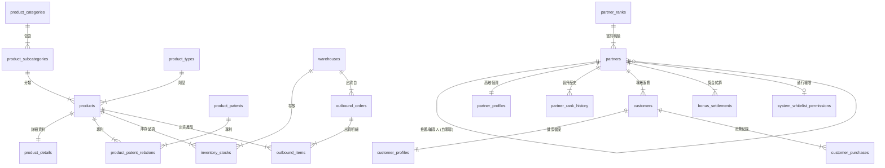

# 葡眾三軌網站 - 全景關聯式資料庫系統藍圖 (Database Schema & ERD)

本目錄為「葡眾三軌網站（公開版 / 團隊版 / 核心樞）」之關聯式資料庫（RDBMS）完整設計規格與實體關聯圖（ERD）。

---

## 1. 全站系統架構總覽 (System ERD Overview)

---

## 2. 8 大領域驅動模組規格索引

* [01. 產品與品牌內容模組 (12 Tables)](./schema/01-product-and-content.md)
* [02. 公司經營與合規模組 (6 Tables)](./schema/02-corporate-and-compliance.md)
* [03. 活動與培訓軍備庫模組 (2 Tables)](./schema/03-events-and-training.md)
* [04. 倉儲與進銷存管理模組 (8 Tables)](./schema/04-inventory-and-logistics.md)
* [05. 夥伴與組織拓撲模組 (6 Tables)](./schema/05-partners-and-network.md)
* [06. 客戶 CRM 與復購模組 (6 Tables)](./schema/06-customer-crm.md)
* [07. 財務對帳與稅務扣繳模組 (5 Tables)](./schema/07-financials-and-tax.md)
* [08. 資安門禁與工具輔助模組 (4 Tables)](./schema/08-security-and-utilities.md)

---

## 3. 全表標準維運稽核欄位 (Common Audit Fields)

全系統 53 個資料表均強制包含以下 4 大維運稽核欄位，確保雙創始人（Ray & Jarvis）維護之**不可竄改軌跡**：

| 欄位名稱 (Field) | 資料型態 (Data Type) | 預設值 (Default) | 業務說明 |
| :--- | :--- | :--- | :--- |
| `created_by` | VARCHAR(100) | `'SYSTEM'` | 建立者（例如：`Jarvis`, `Ray`, 或系統服務） |
| `created_at` | DATETIME | `CURRENT_TIMESTAMP` | 資料建立時間點 |
| `modified_by` | VARCHAR(100) | `'SYSTEM'` | 最後異動者 |
| `modified_at` | DATETIME | `CURRENT_TIMESTAMP ON UPDATE` | 最後異動時間點 |
