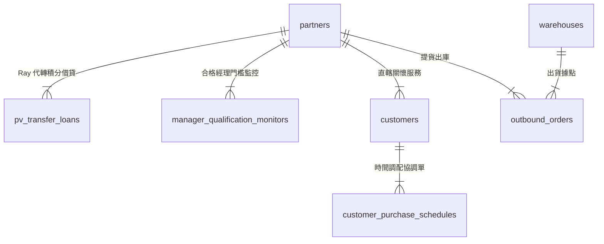

# 榮祥團隊三軌數位陣地 - 全景關聯式資料庫系統藍圖

本目錄為「榮祥團隊（Ray's Team）」專屬網站控制台之關聯式資料庫（RDBMS）完整設計規格。

---

## 1. 全站黃金戰術實體關聯圖 (System ERD)

> **📱 手機端瀏覽提示**：若 GitHub App 無法渲染下方 Mermaid 動態圖，請直接參閱解構對照表。

🔍 點擊展開/收折 Mermaid 動態繪圖語法 (電腦端支援互動)

---

## 2. 7 大領域驅動模組規格索引 (模組名稱皆為 4 個字)

1. [模組一：產品品牌 (12 Tables)](./schema/01-product-and-brand.md)
2. [模組二：公司培訓 (8 Tables)](./schema/02-company-and-training.md) *(合併大事記/榮譽標章/活動/軍備庫)*
3. [模組三：倉儲進銷 (8 Tables)](./schema/03-inventory-and-sales.md)
4. [模組四：夥伴組織 (8 Tables)](./schema/04-partners-and-network.md) *(含 Ray 積分代轉借貸對帳表)*
5. [模組五：客戶關懷 (7 Tables)](./schema/05-customer-crm.md) *(含 Ray 消費時間調配協調表)*
6. [模組六：財務分潤 (3 Tables)](./schema/06-team-financials.md) *(廢除政府稅務健保表)*
7. [模組七：資安工具 (5 Tables)](./schema/07-security-and-utilities.md)
