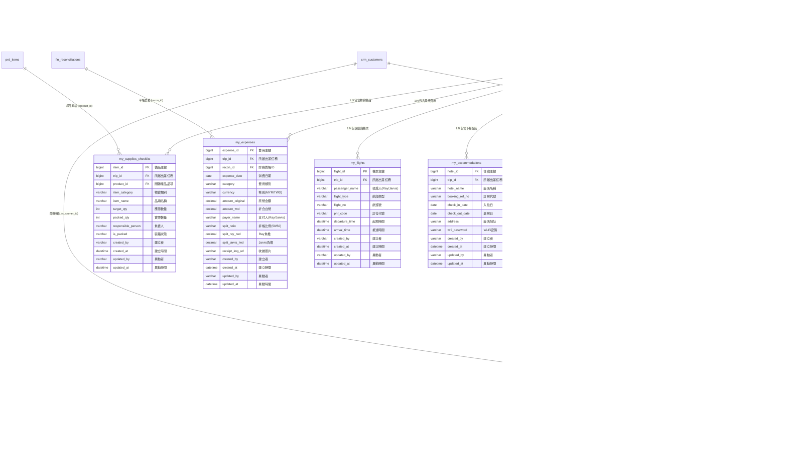

```mermaid
erDiagram
    %% 外部跨模組關聯實體
    org_partners ||--o{ my_itineraries : "參與/輔導夥伴 (partner_id)"
    crm_customers ||--o{ my_itineraries : "會面客戶 (customer_id)"
    crm_customers ||--o{ my_field_notes : "商機轉化 (customer_id)"
    prd_items ||--o{ my_supplies_checklist : "樣品規格 (product_id)"
    fin_reconciliations ||--o{ my_expenses : "平帳單據 (recon_id)"

    %% 馬來西亞模組核心實體
    my_trips ||--o{ my_flights : "1:N 包含航段機票"
    my_trips ||--o{ my_accommodations : "1:N 包含下榻飯店"
    my_trips ||--o{ my_itineraries : "1:N 包含每日排程"
    my_trips ||--o{ my_expenses : "1:N 包含差旅費用"
    my_trips ||--o{ my_supplies_checklist : "1:N 包含物資備品"
    my_trips ||--o{ my_field_notes : "1:N 包含考察筆記"
    my_trips ||--o{ my_transits : "1:N 包含常用交通路線"

    %% 模組內部細部關聯
    my_itineraries ||--o{ my_field_notes : "1:1或1:N 產出會議紀錄 (schedule_id)"

    %% 實體屬性定義
    my_trips {
        bigint trip_id PK "任務主鍵"
        varchar trip_code UK "專案代碼 (如 MY-202608-KL)"
        varchar trip_name "任務名稱"
        date start_date "出發日期"
        date end_date "返台日期"
        decimal total_budget_twd "總預算(台幣)"
        decimal total_budget_myr "總預算(馬幣)"
        varchar status "任務狀態"
        varchar participants "出差人員"
        varchar created_by "建立者"
        datetime created_at "建立時間"
        varchar updated_by "異動者"
        datetime updated_at "異動時間"
    }

    my_flights {
        bigint flight_id PK "機票主鍵"
        bigint trip_id FK "所屬出差任務"
        varchar passenger_name "搭乘人(Ray/Jarvis)"
        varchar flight_type "航段類型"
        varchar flight_no "航班號"
        varchar pnr_code "訂位代號"
        datetime departure_time "起飛時間"
        datetime arrival_time "抵達時間"
        varchar created_by "建立者"
        datetime created_at "建立時間"
        varchar updated_by "異動者"
        datetime updated_at "異動時間"
    }

    my_accommodations {
        bigint hotel_id PK "住宿主鍵"
        bigint trip_id FK "所屬出差任務"
        varchar hotel_name "飯店名稱"
        varchar booking_ref_no "訂房代號"
        date check_in_date "入住日"
        date check_out_date "退房日"
        varchar address "飯店地址"
        varchar wifi_password "Wi-Fi密碼"
        varchar created_by "建立者"
        datetime created_at "建立時間"
        varchar updated_by "異動者"
        datetime updated_at "異動時間"
    }

    my_itineraries {
        bigint schedule_id PK "排程主鍵"
        bigint trip_id FK "所屬出差任務"
        date itinerary_date "行程日期"
        time start_time "開始時間"
        varchar schedule_type "任務屬性"
        varchar location_name "會面地點"
        bigint partner_id FK "關聯夥伴"
        bigint customer_id FK "關聯客戶"
        varchar transit_method "交通方式"
        varchar status "狀態"
        varchar created_by "建立者"
        datetime created_at "建立時間"
        varchar updated_by "異動者"
        datetime updated_at "異動時間"
    }

    my_expenses {
        bigint expense_id PK "費用主鍵"
        bigint trip_id FK "所屬出差任務"
        bigint recon_id FK "財務對帳ID"
        date expense_date "消費日期"
        varchar category "費用類別"
        varchar currency "幣別(MYR/TWD)"
        decimal amount_original "原幣金額"
        decimal amount_twd "折合台幣"
        varchar payer_name "支付人(Ray/Jarvis)"
        varchar split_ratio "拆帳比例(50/50)"
        decimal split_ray_twd "Ray負擔"
        decimal split_jarvis_twd "Jarvis負擔"
        varchar receipt_img_url "收據照片"
        varchar created_by "建立者"
        datetime created_at "建立時間"
        varchar updated_by "異動者"
        datetime updated_at "異動時間"
    }

    my_supplies_checklist {
        bigint item_id PK "備品主鍵"
        bigint trip_id FK "所屬出差任務"
        bigint product_id FK "關聯產品品項"
        varchar item_category "物資類別"
        varchar item_name "品項名稱"
        int target_qty "應帶數量"
        int packed_qty "實帶數量"
        varchar responsible_person "負責人"
        varchar is_packed "裝箱狀態"
        varchar created_by "建立者"
        datetime created_at "建立時間"
        varchar updated_by "異動者"
        datetime updated_at "異動時間"
    }

    my_field_notes {
        bigint note_id PK "筆記主鍵"
        bigint trip_id FK "所屬出差任務"
        bigint schedule_id FK "關聯排程"
        bigint customer_id FK "關聯客戶"
        varchar contact_name "對象姓名"
        varchar contact_phone "電話/WhatsApp"
        varchar target_intent_rank "意向職級"
        text meeting_summary "洽談摘要"
        text action_items "後續待辦"
        varchar lead_quality "商機品質"
        varchar sync_to_crm "同步CRM狀態"
        varchar created_by "建立者"
        datetime created_at "建立時間"
        varchar updated_by "異動者"
        datetime updated_at "異動時間"
    }

    my_transits {
        bigint transit_id PK "交通主鍵"
        bigint trip_id FK "所屬出差任務"
        varchar point_type "交通類型"
        varchar point_name "點位名稱"
        varchar grab_search_keyword "Grab關鍵字"
        varchar full_address "完整地址"
        decimal estimated_fare_myr "預估車資(MYR)"
        varchar created_by "建立者"
        datetime created_at "建立時間"
        varchar updated_by "異動者"
        datetime updated_at "異動時間"
    }
```
