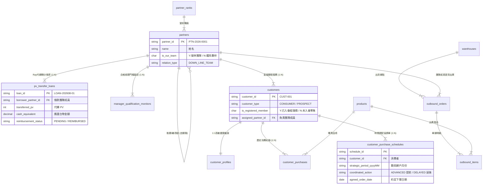

```mermaid
erDiagram
    %% 夥伴與團隊成員鏈
    partner_ranks ||--|{ partners : "當前職級"
    partners ||--o{ partners : "推薦/輔導鏈 (自關聯)"
    partners ||--|{ pv_transfer_loans : "Ray代轉積分借貸 (1:N)"
    partners ||--|{ manager_qualification_monitors : "合格經理門檻監控 (1:N)"

    %% 客戶與採購時間調配鏈
    partners ||--|{ customers : "直轄關懷服務 (1:N)"
    customers ||--|| customer_profiles : "1:1高敏健康檔案"
    customers ||--|{ customer_purchases : "歷史消費紀錄 (1:N)"
    customers ||--|{ customer_purchase_schedules : "時間調配協調單 (1:N)"
    products ||--|{ customer_purchases : "購買品項"

    %% 進銷存與提貨鏈
    warehouses ||--|{ outbound_orders : "出貨據點"
    partners ||--|{ outbound_orders : "團隊成員提貨出庫"
    outbound_orders ||--|{ outbound_items : "單據明細"
    products ||--|{ outbound_items : "出庫產品"

    partners {
        string partner_id PK "PTN-2026-0001"
        string name "姓名"
        char is_our_team "Y:榮祥團隊 / N:體系夥伴"
        string relation_type "DOWN_LINE_TEAM"
    }

    pv_transfer_loans {
        string loan_id PK "LOAN-202608-01"
        string borrower_partner_id FK "借款團隊成員"
        int transferred_pv "代轉 PV"
        decimal cash_equivalent "應還台幣金額"
        string reimbursement_status "PENDING / REIMBURSED"
    }

    customers {
        string customer_id PK "CUST-001"
        string customer_type "CONSUMER / PROSPECT"
        char is_registered_member "Y:已入會經理價 / N:未入會零售"
        string assigned_partner_id FK "負責團隊成員"
    }

    customer_purchase_schedules {
        string schedule_id PK
        string customer_id FK "消費者"
        string strategic_period_yyyyMM "戰術歸戶月份"
        string coordinated_action "ADVANCED 提前 / DELAYED 延後"
        date agreed_order_date "約定下單日期"
    }
```
