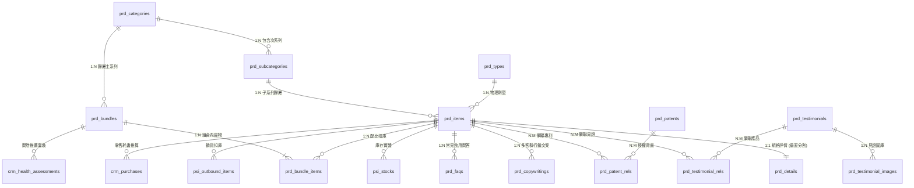

```mermaid
erDiagram
    %% 字典與分類體系
    prd_categories ||--o{ prd_subcategories : "1:N 包含次系列"
    prd_categories ||--o{ prd_bundles : "1:N 歸屬主系列"
    prd_subcategories ||--o{ prd_items : "1:N 子系列歸屬"
    prd_types ||--o{ prd_items : "1:N 物理劑型"

    %% 產品核心主檔與垂直分割
    prd_items ||--|| prd_details : "1:1 規格詳情 (垂直分割)"
    prd_items ||--o{ prd_copywritings : "1:N 多客群行銷文案"
    prd_items ||--o{ prd_faqs : "1:N 常見食用問答"

    %% 見證體系 (N:M 解耦)
    prd_items ||--o{ prd_testimonial_rels : "N:M 關聯見證"
    prd_testimonials ||--o{ prd_testimonial_rels : "N:M 關聯產品"
    prd_testimonials ||--o{ prd_testimonial_images : "1:N 見證圖庫"

    %% 專利體系 (N:M 解耦)
    prd_items ||--o{ prd_patent_rels : "N:M 關聯專利"
    prd_patents ||--o{ prd_patent_rels : "N:M 授權背書"

    %% 套裝組合體系
    prd_bundles ||--|{ prd_bundle_items : "1:N 組合內容物"
    prd_items ||--o{ prd_bundle_items : "1:N 配比扣庫"

    %% 跨模組外部關聯 (PSI / CRM)
    prd_items ||--o{ psi_stocks : "庫存實體"
    prd_items ||--o{ psi_outbound_items : "銷貨扣庫"
    prd_items ||--o{ crm_purchases : "零售耗盡推算"
    prd_bundles ||--o{ crm_health_assessments : "問卷推薦套裝"
```
