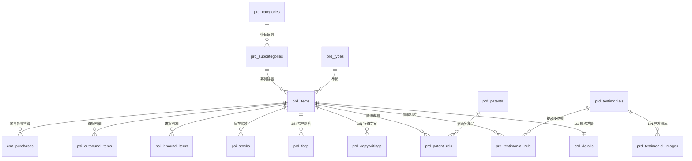

```mermaid
erDiagram
    %% 字典與分類體系
    prd_categories ||--o{ prd_subcategories : "擁有系列"
    prd_subcategories ||--o{ prd_items : "系列歸屬"
    prd_types ||--o{ prd_items : "型態"

    %% 產品核心與擴展
    prd_items ||--|| prd_details : "1:1 規格詳情"
    prd_items ||--o{ prd_copywritings : "1:N 行銷文案"
    prd_items ||--o{ prd_faqs : "1:N 常見問答"

    %% 見證體系 (N:M)
    prd_items ||--o{ prd_testimonial_rels : "關聯見證"
    prd_testimonials ||--o{ prd_testimonial_rels : "提及多品項"
    prd_testimonials ||--o{ prd_testimonial_images : "1:N 見證圖庫"

    %% 專利體系 (N:M)
    prd_items ||--o{ prd_patent_rels : "關聯專利"
    prd_patents ||--o{ prd_patent_rels : "涵蓋多產品"

    %% 外部模組關聯 (PSI / CRM)
    prd_items ||--o{ psi_stocks : "庫存實體"
    prd_items ||--o{ psi_inbound_items : "進貨明細"
    prd_items ||--o{ psi_outbound_items : "銷貨明細"
    prd_items ||--o{ crm_purchases : "零售耗盡推算"
```
