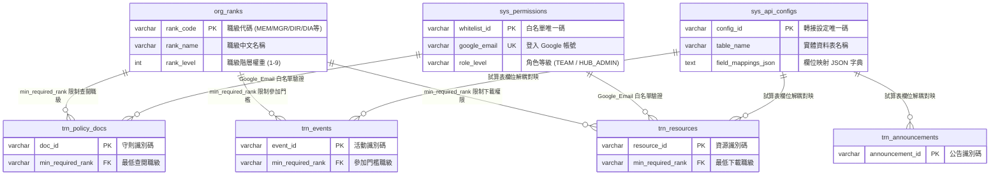

```mermaid
erDiagram
    %% =========================================================================
    %% 外部模組：組織模組 (Organization) & 系統模組 (System)
    %% =========================================================================
    org_ranks ||--o{ trn_policy_docs : "min_required_rank 限制查閱職級"
    org_ranks ||--o{ trn_events : "min_required_rank 限制參加門檻"
    org_ranks ||--o{ trn_resources : "min_required_rank 限制下載權限"

    sys_permissions ||--o{ trn_policy_docs : "Google_Email 白名單驗證"
    sys_permissions ||--o{ trn_resources : "Google_Email 白名單驗證"

    sys_api_configs ||--o{ trn_announcements : "試算表欄位解耦對映"
    sys_api_configs ||--o{ trn_events : "試算表欄位解耦對映"
    sys_api_configs ||--o{ trn_resources : "試算表欄位解耦對映"

    org_ranks {
        varchar rank_code PK "職級代碼 (MEM/MGR/DIR/DIA等)"
        varchar rank_name "職級中文名稱"
        int rank_level "職級階層權重 (1-9)"
    }

    sys_permissions {
        varchar whitelist_id PK "白名單唯一碼"
        varchar google_email UK "登入 Google 帳號"
        varchar role_level "角色等級 (TEAM / HUB_ADMIN)"
    }

    sys_api_configs {
        varchar config_id PK "轉接設定唯一碼"
        varchar table_name "實體資料表名稱"
        text field_mappings_json "欄位映射 JSON 字典"
    }

    trn_policy_docs {
        varchar doc_id PK "守則識別碼"
        varchar min_required_rank FK "最低查閱職級"
    }

    trn_events {
        varchar event_id PK "活動識別碼"
        varchar min_required_rank FK "參加門檻職級"
    }

    trn_resources {
        varchar resource_id PK "資源識別碼"
        varchar min_required_rank FK "最低下載職級"
    }

    trn_announcements {
        varchar announcement_id PK "公告識別碼"
    }

```