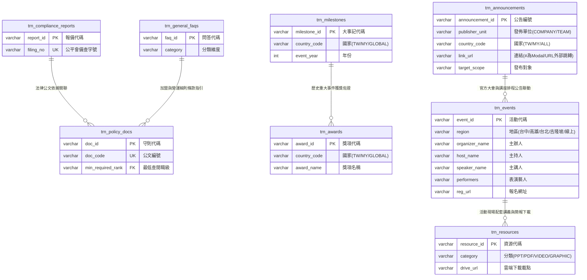

```mermaid
erDiagram
    %% =========================================================================
    %% 業務集群 A：品牌背書與法規治理集群 (Public Trust Cluster)
    %% =========================================================================
    trn_compliance_reports ||--o{ trn_policy_docs : "法律公文依據關聯"
    trn_milestones ||--o{ trn_awards : "歷史重大事件獲獎佐證"

    %% =========================================================================
    %% 業務集群 B：營運發布與活動排程集群 (Operations & Events Cluster)
    %% =========================================================================
    trn_announcements ||--o{ trn_events : "官方大會與講座排程公告聯動"
    trn_events ||--o{ trn_resources : "活動現場配套講義與簡報下載"

    %% =========================================================================
    %% 業務集群 C：通識知識庫 (Knowledge Base Cluster)
    %% =========================================================================
    trn_general_faqs ||--o{ trn_policy_docs : "加盟與營運細則條款指引"

    trn_announcements {
        varchar announcement_id PK "公告編號"
        varchar publisher_unit "發佈單位(COMPANY/TEAM)"
        varchar country_code "國家(TW/MY/ALL)"
        varchar link_url "連結(#為Modal/URL外部跳轉)"
        varchar target_scope "發布對象"
    }

    trn_events {
        varchar event_id PK "活動代碼"
        varchar region "地區(台中/高雄/台北/吉隆坡/線上)"
        varchar organizer_name "主辦人"
        varchar host_name "主持人"
        varchar speaker_name "主講人"
        varchar performers "表演藝人"
        varchar reg_url "報名網址"
    }

    trn_resources {
        varchar resource_id PK "資源代碼"
        varchar category "分類(PPT/PDF/VIDEO/GRAPHIC)"
        varchar drive_url "雲端下載載點"
    }

    trn_policy_docs {
        varchar doc_id PK "守則代碼"
        varchar doc_code UK "公文編號"
        varchar min_required_rank FK "最低查閱職級"
    }

    trn_compliance_reports {
        varchar report_id PK "報備代碼"
        varchar filing_no UK "公平會備查字號"
    }

    trn_milestones {
        varchar milestone_id PK "大事記代碼"
        varchar country_code "國家(TW/MY/GLOBAL)"
        int event_year "年份"
    }

    trn_awards {
        varchar award_id PK "獎項代碼"
        varchar country_code "國家(TW/MY/GLOBAL)"
        varchar award_name "獎項名稱"
    }

    trn_general_faqs {
        varchar faq_id PK "問答代碼"
        varchar category "分類維度"
    }

```