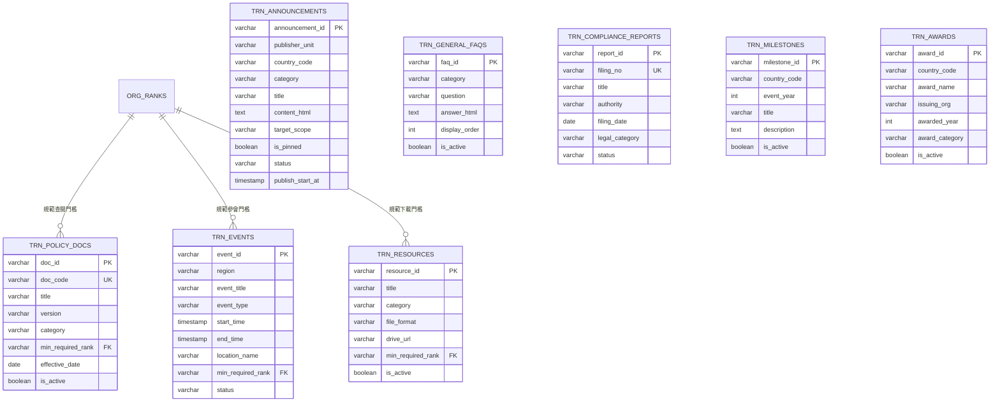

```mermaid
erDiagram
    %% 組織模組依賴 (關聯表)
    ORG_RANKS ||--o{ TRN_POLICY_DOCS : "規範查閱門檻"
    ORG_RANKS ||--o{ TRN_EVENTS : "規範參會門檻"
    ORG_RANKS ||--o{ TRN_RESOURCES : "規範下載門檻"

    %% 培訓模組核心 8 表
    TRN_ANNOUNCEMENTS {
        varchar announcement_id PK
        varchar publisher_unit
        varchar country_code
        varchar category
        varchar title
        text content_html
        varchar target_scope
        boolean is_pinned
        varchar status
        timestamp publish_start_at
    }

    TRN_GENERAL_FAQS {
        varchar faq_id PK
        varchar category
        varchar question
        text answer_html
        int display_order
        boolean is_active
    }

    TRN_POLICY_DOCS {
        varchar doc_id PK
        varchar doc_code UK
        varchar title
        varchar version
        varchar category
        varchar min_required_rank FK
        date effective_date
        boolean is_active
    }

    TRN_COMPLIANCE_REPORTS {
        varchar report_id PK
        varchar filing_no UK
        varchar title
        varchar authority
        date filing_date
        varchar legal_category
        varchar status
    }

    TRN_MILESTONES {
        varchar milestone_id PK
        varchar country_code
        int event_year
        varchar title
        text description
        boolean is_active
    }

    TRN_AWARDS {
        varchar award_id PK
        varchar country_code
        varchar award_name
        varchar issuing_org
        int awarded_year
        varchar award_category
        boolean is_active
    }

    TRN_EVENTS {
        varchar event_id PK
        varchar region
        varchar event_title
        varchar event_type
        timestamp start_time
        timestamp end_time
        varchar location_name
        varchar min_required_rank FK
        varchar status
    }

    TRN_RESOURCES {
        varchar resource_id PK
        varchar title
        varchar category
        varchar file_format
        varchar drive_url
        varchar min_required_rank FK
        boolean is_active
    }
```
