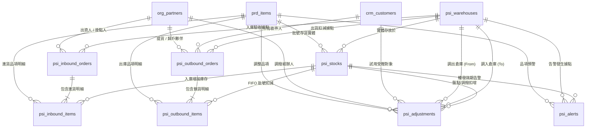

```mermaid
erDiagram
    %% 外部依賴實體主檔
    prd_items ||--o{ psi_stocks : "批號存貨實體"
    prd_items ||--o{ psi_inbound_items : "進貨品項明細"
    prd_items ||--o{ psi_outbound_items : "出庫品項明細"
    prd_items ||--o{ psi_adjustments : "調整品項"
    prd_items ||--o{ psi_alerts : "品項預警"

    org_partners ||--o{ psi_inbound_orders : "出資人 / 掛點人"
    org_partners ||--o{ psi_outbound_orders : "提貨 / 歸戶夥伴"
    org_partners ||--o{ psi_adjustments : "調撥經辦人"
    crm_customers ||--o{ psi_outbound_orders : "零售收件人"
    crm_customers ||--o{ psi_adjustments : "試用受贈對象"

    %% 進銷存模組內部關聯
    psi_warehouses ||--o{ psi_stocks : "實體存放於"
    psi_warehouses ||--o{ psi_inbound_orders : "入庫驗收據點"
    psi_warehouses ||--o{ psi_outbound_orders : "出貨扣減據點"
    psi_warehouses ||--o{ psi_adjustments : "調出倉庫 (From)"
    psi_warehouses ||--o{ psi_adjustments : "調入倉庫 (To)"
    psi_warehouses ||--o{ psi_alerts : "告警發生據點"

    psi_inbound_orders ||--|{ psi_inbound_items : "包含進貨明細"
    psi_outbound_orders ||--|{ psi_outbound_items : "包含銷貨明細"

    psi_stocks ||--o{ psi_inbound_items : "入庫增加庫存"
    psi_stocks ||--o{ psi_outbound_items : "FIFO 批號扣減"
    psi_stocks ||--o{ psi_adjustments : "盤點/調撥扣增"
    psi_stocks ||--o{ psi_alerts : "觸發效期告警"
```
