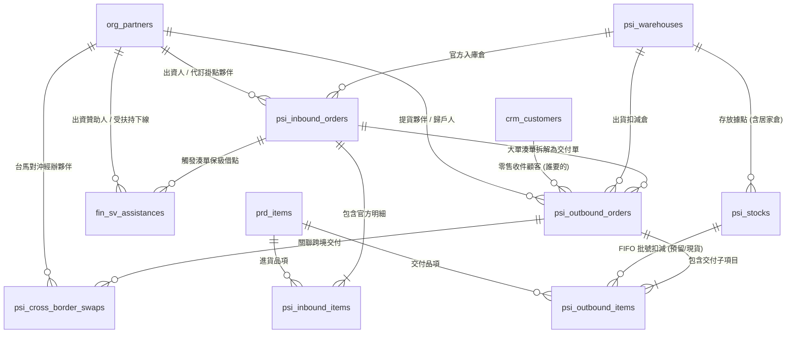

```mermaid
erDiagram
    %% 核心實體
    org_partners ||--o{ psi_inbound_orders : "出資人 / 代訂掛點夥伴"
    org_partners ||--o{ psi_outbound_orders : "提貨夥伴 / 歸戶人"
    org_partners ||--o{ fin_sv_assistances : "出資贊助人 / 受扶持下線"
    org_partners ||--o{ psi_cross_border_swaps : "台馬對沖經辦夥伴"
    crm_customers ||--o{ psi_outbound_orders : "零售收件顧客 (誰要的)"
    prd_items ||--o{ psi_inbound_items : "進貨品項"
    prd_items ||--o{ psi_outbound_items : "交付品項"

    %% 進銷存內部流向
    psi_warehouses ||--o{ psi_stocks : "存放據點 (含居家倉)"
    psi_warehouses ||--o{ psi_inbound_orders : "官方入庫倉"
    psi_warehouses ||--o{ psi_outbound_orders : "出貨扣減倉"

    psi_inbound_orders ||--|{ psi_inbound_items : "包含官方明細"
    psi_inbound_orders ||--o{ psi_outbound_orders : "大單湊單拆解為交付單"
    psi_inbound_orders ||--o{ fin_sv_assistances : "觸發湊單保級借點"

    psi_stocks ||--o{ psi_outbound_items : "FIFO 批號扣減 (預留/現貨)"
    psi_outbound_orders ||--|{ psi_outbound_items : "包含交付子項目"
    psi_outbound_orders ||--o{ psi_cross_border_swaps : "關聯跨境交付"
```
