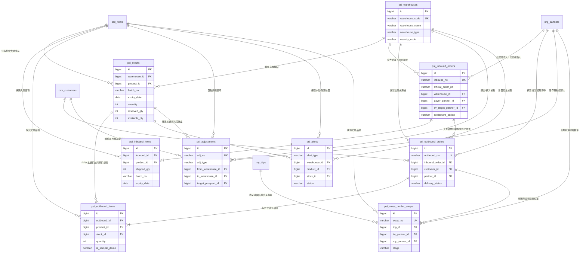

```mermaid
erDiagram
    %% 外部關聯實體
    prd_items ||--o{ psi_stocks : "持有批號實體庫存"
    prd_items ||--o{ psi_inbound_items : "採購入庫品項"
    prd_items ||--o{ psi_outbound_items : "銷貨交付品項"
    prd_items ||--o{ psi_adjustments : "盤點調撥品項"
    prd_items ||--o{ psi_alerts : "觸發水位/效期告警"
    prd_items ||--o{ psi_cross_border_swaps : "跨境交付品項"

    org_partners ||--o{ psi_inbound_orders : "出資付款人 / 代訂掛點人"
    org_partners ||--o{ psi_outbound_orders : "調貨/提貨經辦夥伴"
    org_partners ||--o{ psi_adjustments : "庫存異動經辦人"
    org_partners ||--o{ psi_cross_border_swaps : "台馬對沖經辦夥伴"

    crm_customers ||--o{ psi_outbound_orders : "零售收件顧客 (誰要的)"
    crm_customers ||--o{ psi_adjustments : "體驗試用樣品受贈人"

    my_trips ||--o{ psi_cross_border_swaps : "綁定跨國拓荒出差專案"

    %% 進銷存內部關聯拓撲
    psi_warehouses ||--o{ psi_stocks : "劃分存放據點"
    psi_warehouses ||--o{ psi_inbound_orders : "官方驗收入庫目標倉"
    psi_warehouses ||--o{ psi_outbound_orders : "銷貨出庫來源倉"
    psi_warehouses ||--o{ psi_adjustments : "調出/調入據點"
    psi_warehouses ||--o{ psi_alerts : "告警發生據點"

    psi_inbound_orders ||--|{ psi_inbound_items : "包含官方採購明細"
    psi_inbound_orders ||--o{ psi_outbound_orders : "大單湊單拆解為客戶交付單"

    psi_stocks ||--o{ psi_outbound_items : "FIFO 批號扣減與預扣鎖定"
    psi_stocks ||--o{ psi_alerts : "近效期實體掃描"
    psi_stocks ||--o{ psi_adjustments : "特定批號損耗與拆盒"

    psi_outbound_orders ||--|{ psi_outbound_items : "包含出貨子項目"
    psi_outbound_orders ||--o{ psi_cross_border_swaps : "關聯跨境現貨交付單"

    psi_warehouses {
        bigint id PK
        varchar warehouse_code UK
        varchar warehouse_name
        varchar warehouse_type
        varchar country_code
    }

    psi_stocks {
        bigint id PK
        bigint warehouse_id FK
        bigint product_id FK
        varchar batch_no
        date expiry_date
        int quantity
        int reserved_qty
        int available_qty
    }

    psi_inbound_orders {
        bigint id PK
        varchar inbound_no UK
        varchar official_order_no
        bigint warehouse_id FK
        bigint payer_partner_id FK
        bigint sv_target_partner_id FK
        varchar settlement_period
    }

    psi_inbound_items {
        bigint id PK
        bigint inbound_id FK
        bigint product_id FK
        int shipped_qty
        varchar batch_no
        date expiry_date
    }

    psi_outbound_orders {
        bigint id PK
        varchar outbound_no UK
        bigint inbound_order_id FK
        bigint customer_id FK
        bigint partner_id FK
        varchar delivery_status
    }

    psi_outbound_items {
        bigint id PK
        bigint outbound_id FK
        bigint product_id FK
        bigint stock_id FK
        int quantity
        boolean is_sample_demo
    }

    psi_adjustments {
        bigint id PK
        varchar adj_no UK
        varchar adj_type
        bigint from_warehouse_id FK
        bigint to_warehouse_id FK
        bigint target_prospect_id FK
    }

    psi_alerts {
        bigint id PK
        varchar alert_type
        bigint warehouse_id FK
        bigint product_id FK
        bigint stock_id FK
        varchar status
    }

    psi_cross_border_swaps {
        bigint id PK
        varchar swap_no UK
        bigint trip_id FK
        bigint tw_partner_id FK
        bigint my_partner_id FK
        varchar stage
    }
```
