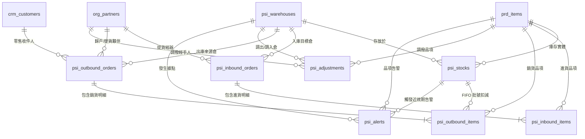

```mermaid
erDiagram
    %% 外部依賴核心表
    prd_items ||--o{ psi_stocks : "庫存實體"
    prd_items ||--o{ psi_inbound_items : "進貨品項"
    prd_items ||--o{ psi_outbound_items : "銷貨品項"
    prd_items ||--o{ psi_adjustments : "調撥品項"
    prd_items ||--o{ psi_alerts : "品項告警"
    
    org_partners ||--o{ psi_inbound_orders : "提貨經辦"
    org_partners ||--o{ psi_outbound_orders : "歸戶/提貨夥伴"
    org_partners ||--o{ psi_adjustments : "調撥經手人"
    crm_customers ||--o{ psi_outbound_orders : "零售收件人"

    %% 進銷存內部關聯
    psi_warehouses ||--o{ psi_stocks : "存放於"
    psi_warehouses ||--o{ psi_inbound_orders : "入庫目標倉"
    psi_warehouses ||--o{ psi_outbound_orders : "出庫來源倉"
    psi_warehouses ||--o{ psi_adjustments : "調出/調入倉"
    psi_warehouses ||--o{ psi_alerts : "發生據點"

    psi_inbound_orders ||--|{ psi_inbound_items : "包含進貨明細"
    psi_outbound_orders ||--|{ psi_outbound_items : "包含銷貨明細"

    psi_stocks ||--o{ psi_outbound_items : "FIFO 批號扣減"
    psi_stocks ||--o{ psi_alerts : "觸發近效期告警"
```
