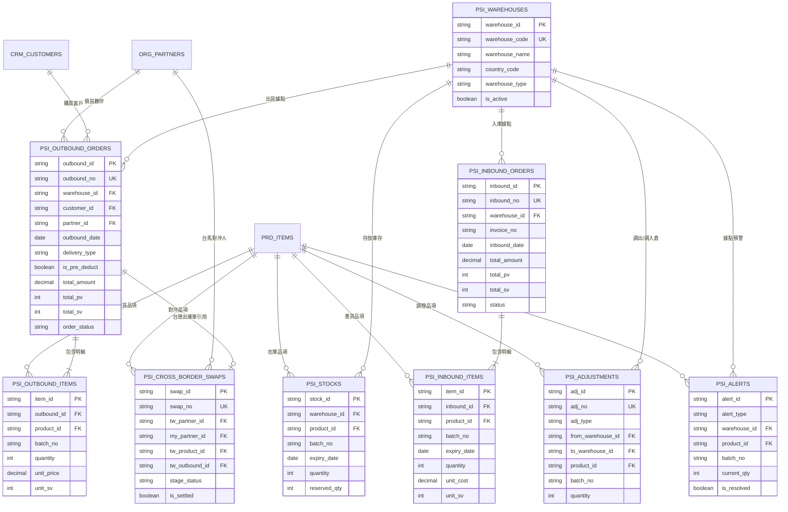

```mermaid
erDiagram
    %% 外部關聯表
    PRD_ITEMS ||--o{ PSI_STOCKS : "在庫品項"
    PRD_ITEMS ||--o{ PSI_INBOUND_ITEMS : "進貨品項"
    PRD_ITEMS ||--o{ PSI_OUTBOUND_ITEMS : "銷貨品項"
    PRD_ITEMS ||--o{ PSI_ADJUSTMENTS : "調撥品項"
    PRD_ITEMS ||--o{ PSI_ALERTS : "預警品項"
    PRD_ITEMS ||--o{ PSI_CROSS_BORDER_SWAPS : "對沖品項"

    ORG_PARTNERS ||--o{ PSI_OUTBOUND_ORDERS : "領貨夥伴"
    ORG_PARTNERS ||--o{ PSI_CROSS_BORDER_SWAPS : "台馬對沖人"
    CRM_CUSTOMERS ||--o{ PSI_OUTBOUND_ORDERS : "購買客戶"

    %% 進銷存核心表
    PSI_WAREHOUSES ||--o{ PSI_STOCKS : "存放庫存"
    PSI_WAREHOUSES ||--o{ PSI_INBOUND_ORDERS : "入庫據點"
    PSI_WAREHOUSES ||--o{ PSI_OUTBOUND_ORDERS : "出貨據點"
    PSI_WAREHOUSES ||--o{ PSI_ADJUSTMENTS : "調出/調入倉"
    PSI_WAREHOUSES ||--o{ PSI_ALERTS : "據點預警"

    PSI_INBOUND_ORDERS ||--|{ PSI_INBOUND_ITEMS : "包含明細"
    PSI_OUTBOUND_ORDERS ||--|{ PSI_OUTBOUND_ITEMS : "包含明細"

    PSI_OUTBOUND_ORDERS ||--o| PSI_CROSS_BORDER_SWAPS : "台灣出庫單引用"

    PSI_WAREHOUSES {
        string warehouse_id PK
        string warehouse_code UK
        string warehouse_name
        string country_code
        string warehouse_type
        boolean is_active
    }

    PSI_STOCKS {
        string stock_id PK
        string warehouse_id FK
        string product_id FK
        string batch_no
        date expiry_date
        int quantity
        int reserved_qty
    }

    PSI_INBOUND_ORDERS {
        string inbound_id PK
        string inbound_no UK
        string warehouse_id FK
        string invoice_no
        date inbound_date
        decimal total_amount
        int total_pv
        int total_sv
        string status
    }

    PSI_INBOUND_ITEMS {
        string item_id PK
        string inbound_id FK
        string product_id FK
        string batch_no
        date expiry_date
        int quantity
        decimal unit_cost
        int unit_sv
    }

    PSI_OUTBOUND_ORDERS {
        string outbound_id PK
        string outbound_no UK
        string warehouse_id FK
        string customer_id FK
        string partner_id FK
        date outbound_date
        string delivery_type
        boolean is_pre_deduct
        decimal total_amount
        int total_pv
        int total_sv
        string order_status
    }

    PSI_OUTBOUND_ITEMS {
        string item_id PK
        string outbound_id FK
        string product_id FK
        string batch_no
        int quantity
        decimal unit_price
        int unit_sv
    }

    PSI_ADJUSTMENTS {
        string adj_id PK
        string adj_no UK
        string adj_type
        string from_warehouse_id FK
        string to_warehouse_id FK
        string product_id FK
        string batch_no
        int quantity
    }

    PSI_ALERTS {
        string alert_id PK
        string alert_type
        string warehouse_id FK
        string product_id FK
        string batch_no
        int current_qty
        boolean is_resolved
    }

    PSI_CROSS_BORDER_SWAPS {
        string swap_id PK
        string swap_no UK
        string tw_partner_id FK
        string my_partner_id FK
        string tw_product_id FK
        string tw_outbound_id FK
        string stage_status
        boolean is_settled
    }
```
