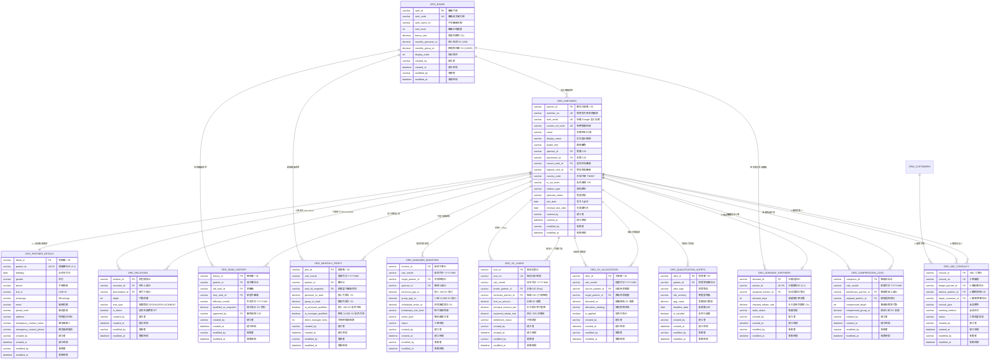

```mermaid
erDiagram
    %% ==========================================
    %% 外部模組關聯
    %% ==========================================
    CRM_CUSTOMERS ||--o{ ORG_ABC_CONSULTS : "C 顧客對象"

    %% ==========================================
    %% 組織模組 13 張核心實體表
    %% ==========================================
    ORG_RANKS ||--o{ ORG_PARTNERS : "當前職級標準"
    ORG_RANKS ||--o{ ORG_RANK_HISTORY : "異動職級標準"
    ORG_RANKS ||--o{ ORG_MONTHLY_PERFS : "結算職級標準"
    ORG_RANKS ||--o{ ORG_DORMANT_PARTNERS : "歷史鎖定最高職級"

    ORG_PARTNERS ||--|| ORG_PARTNER_DETAILS : "1:1 垂直聯絡個資"
    ORG_PARTNERS ||--o{ ORG_RELATIONS : "上線祖先 (Ancestor)"
    ORG_PARTNERS ||--o{ ORG_RELATIONS : "下線後代 (Descendant)"
    ORG_PARTNERS ||--o{ ORG_RANK_HISTORY : "晉升歷程記錄"
    ORG_PARTNERS ||--o{ ORG_MONTHLY_PERFS : "月度業績結算"
    ORG_PARTNERS ||--o{ ORG_MANAGER_MONITORS : "監控目標經理"
    ORG_PARTNERS ||--o{ ORG_SV_LOANS : "出借人 (Ray)"
    ORG_PARTNERS ||--o{ ORG_SV_LOANS : "借點人 (下線經理)"
    ORG_PARTNERS ||--o{ ORG_SV_ALLOCATIONS : "出點來源帳號"
    ORG_PARTNERS ||--o{ ORG_SV_ALLOCATIONS : "落點目標帳號"
    ORG_PARTNERS ||--o{ ORG_QUALIFICATION_ALERTS : "資格告警對象"
    ORG_PARTNERS ||--o| ORG_DORMANT_PARTNERS : "沉睡認領夥伴"
    ORG_PARTNERS ||--o{ ORG_COMPRESSION_LOGS : "緊縮受益上線"
    ORG_PARTNERS ||--o{ ORG_COMPRESSION_LOGS : "緊縮跳過經理"
    ORG_PARTNERS ||--o{ ORG_ABC_CONSULTS : "B 橋樑發起人"
    ORG_PARTNERS ||--o{ ORG_ABC_CONSULTS : "A 顧問受邀人"

    ORG_PARTNERS {
        varchar partner_id PK "夥伴內部唯一ID"
        varchar member_no UK "葡眾官方直銷商編號"
        varchar auth_email UK "授權 Google 登入信箱"
        varchar custom_ref_code UK "專屬推廣短碼"
        varchar name "真實姓名/行號"
        varchar display_name "前台展示暱稱"
        varchar leader_title "團隊職銜"
        varchar sponsor_id FK "推薦人ID"
        varchar placement_id FK "安置人ID"
        varchar current_rank_id FK "當前生效職級"
        varchar highest_rank_id FK "歷史最高職級"
        varchar country_code "市場代碼 TW/MY"
        varchar is_our_team "是否直轄 Y/N"
        varchar relation_type "關係屬性"
        varchar operator_status "營運狀態"
        date join_date "官方入會日"
        date renewal_due_date "年度續約日"
        varchar created_by "建立者"
        datetime created_at "建立時間"
        varchar modified_by "異動者"
        datetime modified_at "異動時間"
    }

    ORG_PARTNER_DETAILS {
        varchar detail_id PK "明細唯一ID"
        varchar partner_id UK,FK "關聯夥伴ID (1:1)"
        date birthday "出生年月日"
        varchar gender "性別"
        varchar phone "手機號碼"
        varchar line_id "LINE ID"
        varchar whatsapp "WhatsApp"
        varchar email "聯絡信箱"
        varchar postal_code "郵遞區號"
        varchar address "物資配送地址"
        varchar emergency_contact_name "緊急聯絡人"
        varchar emergency_contact_phone "緊急聯絡電話"
        varchar created_by "建立者"
        datetime created_at "建立時間"
        varchar modified_by "異動者"
        datetime modified_at "異動時間"
    }

    ORG_RELATIONS {
        varchar relation_id PK "閉包關係ID"
        varchar ancestor_id FK "祖先上線ID"
        varchar descendant_id FK "後代下線ID"
        int depth "代數距離"
        varchar tree_type "樹鏈類型 SPONSOR/PLACEMENT"
        boolean is_direct "是否為直屬第1代"
        varchar created_by "建立者"
        datetime created_at "建立時間"
        varchar modified_by "異動者"
        datetime modified_at "異動時間"
    }

    ORG_RANKS {
        varchar rank_id PK "職級代碼"
        varchar rank_code UK "職級英文識別碼"
        varchar rank_name_zh "中文職級名稱"
        int rank_level "職級位階權重"
        decimal bonus_rate "階差回饋率 (%)"
        decimal monthly_personal_sv "個人低標 SV (160)"
        decimal monthly_group_sv "經理責任額 SV (12000)"
        int display_order "顯示順序"
        varchar created_by "建立者"
        datetime created_at "建立時間"
        varchar modified_by "異動者"
        datetime modified_at "異動時間"
    }

    ORG_RANK_HISTORY {
        varchar history_id PK "歷程唯一ID"
        varchar partner_id FK "晉升夥伴ID"
        varchar old_rank_id FK "原職級"
        varchar new_rank_id FK "新晉升職級"
        varchar effective_month "生效月份 YYYY-MM"
        decimal qualified_sv_snapshot "晉升累計 SV 快照"
        varchar approved_by FK "審核領導人ID"
        varchar created_by "建立者"
        datetime created_at "建立時間"
        varchar modified_by "異動者"
        datetime modified_at "異動時間"
    }

    ORG_MONTHLY_PERFS {
        varchar perf_id PK "結算唯一ID"
        varchar calc_month "業績月份 YYYY-MM"
        varchar partner_id FK "夥伴ID"
        varchar rank_id_snapshot FK "結算當下職級快照"
        decimal personal_sv_total "個人月累計 SV"
        decimal group_sv_total "整組月累計 SV"
        boolean is_personal_qualified "個人 160 SV 是否合格"
        boolean is_manager_qualified "經理 12,000 SV 是否合格"
        int direct_manager_lines "合格經理線路數"
        varchar created_by "建立者"
        datetime created_at "建立時間"
        varchar modified_by "異動者"
        datetime modified_at "異動時間"
    }

    ORG_MANAGER_MONITORS {
        varchar monitor_id PK "監控工單ID"
        varchar calc_month "監控月份 YYYY-MM"
        varchar target_partner_id FK "目標經理ID"
        varchar sponsor_id FK "輔導上線ID"
        decimal personal_gap_sv "個人 160 SV 缺口"
        decimal group_gap_sv "小組 12,000 SV 缺口"
        decimal scheduled_order_sv "排程調度預計 SV"
        varchar breakaway_risk_level "斷代風險等級"
        varchar action_plan "戰術調度方案"
        varchar status "工單狀態"
        varchar created_by "建立者"
        datetime created_at "建立時間"
        varchar modified_by "異動者"
        datetime modified_at "異動時間"
    }

    ORG_SV_LOANS {
        varchar loan_id PK "借貸記錄ID"
        varchar loan_no UK "借貸流水單號"
        varchar calc_month "發生月份 YYYY-MM"
        varchar lender_partner_id FK "出借人ID (Ray)"
        varchar borrower_partner_id FK "借點人ID (下線經理)"
        decimal loan_sv_amount "出借 SV 點數"
        decimal principal_amount_twd "折合新台幣代墊款"
        decimal expected_rebate_twd "預計 20% 回饋金"
        varchar settlement_status "沖銷狀態"
        varchar created_by "建立者"
        datetime created_at "建立時間"
        varchar modified_by "異動者"
        datetime modified_at "異動時間"
    }

    ORG_SV_ALLOCATIONS {
        varchar alloc_id PK "方案唯一ID"
        varchar calc_month "規劃月份 YYYY-MM"
        varchar source_partner_id FK "出點來源帳號"
        varchar target_partner_id FK "落點目標帳號"
        decimal allocated_sv "建議落點 SV 點數"
        varchar allocation_strategy "落點策略目標"
        boolean is_applied "是否已執行"
        varchar created_by "建立者"
        datetime created_at "建立時間"
        varchar modified_by "異動者"
        datetime modified_at "異動時間"
    }

    ORG_QUALIFICATION_ALERTS {
        varchar alert_id PK "預警唯一ID"
        varchar partner_id FK "預警對象夥伴ID"
        varchar alert_type "預警類型"
        varchar risk_severity "嚴重度等級"
        decimal gap_value "差額缺口數值"
        date deadline_date "處置截止日"
        boolean is_handled "是否已處置"
        varchar created_by "建立者"
        datetime created_at "建立時間"
        varchar modified_by "異動者"
        datetime modified_at "異動時間"
    }

    ORG_DORMANT_PARTNERS {
        varchar dormant_id PK "沉睡記錄ID"
        varchar partner_id UK,FK "沉睡夥伴ID (1:1)"
        varchar assigned_mentor_id FK "指派認領主管ID"
        int dormant_days "連續無訂單天數"
        decimal retained_rebate_rate "永久鎖定回饋率 (%)"
        varchar wake_status "喚醒狀態"
        varchar created_by "建立者"
        datetime created_at "建立時間"
        varchar modified_by "異動者"
        datetime modified_at "異動時間"
    }

    ORG_COMPRESSION_LOGS {
        varchar compress_id PK "緊縮日誌ID"
        varchar calc_month "結算月份 YYYY-MM"
        varchar beneficiary_partner_id FK "緊縮受益上線ID"
        varchar skipped_partner_id FK "被跳過經理ID"
        int compressed_depth "緊縮後實質代數"
        decimal compressed_group_sv "歸併小組 SV 業績"
        varchar created_by "建立者"
        datetime created_at "建立時間"
        varchar modified_by "異動者"
        datetime modified_at "異動時間"
    }

    ORG_ABC_CONSULTS {
        varchar consult_id PK "ABC 工單ID"
        varchar consult_no UK "工單編號"
        varchar bridge_partner_id FK "B 橋樑夥伴ID"
        varchar advisor_partner_id FK "A 顧問領導人ID"
        varchar target_customer_id FK "C 顧客/準夥伴ID"
        varchar consult_type "會談屬性"
        varchar meeting_method "會談形式"
        varchar status "工單進度狀態"
        varchar created_by "建立者"
        datetime created_at "建立時間"
        varchar modified_by "異動者"
        datetime modified_at "異動時間"
    }
```
