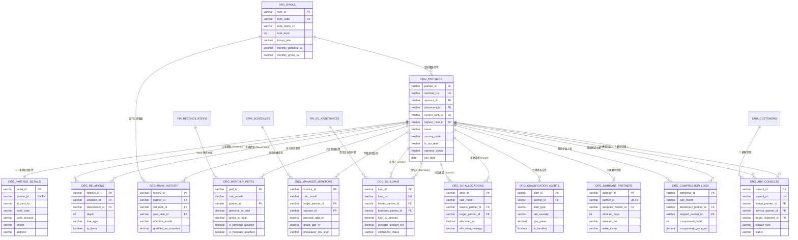

```mermaid
erDiagram
    %% ==========================================
    %% 外部依賴核心模組
    %% ==========================================
    CRM_CUSTOMERS ||--o{ ORG_ABC_CONSULTS : "C 顧客關聯"
    CRM_SCHEDULES ||--o{ ORG_MANAGER_MONITORS : "調度採購排程"
    FIN_RECONCILIATIONS ||--o{ ORG_MONTHLY_PERFS : "50/50 對拆依據"
    FIN_SV_ASSISTANCES ||--o{ ORG_SV_LOANS : "獎金日自動沖銷"

    %% ==========================================
    %% 組織模組 13 張核心實體表
    %% ==========================================
    ORG_RANKS ||--o{ ORG_PARTNERS : "當前職級標準"
    ORG_RANKS ||--o{ ORG_RANK_HISTORY : "晉升目標職級"
    
    ORG_PARTNERS ||--|| ORG_PARTNER_DETAILS : "1:1 垂直個資加密"
    ORG_PARTNERS ||--o{ ORG_RELATIONS : "上線節點 (Ancestor)"
    ORG_PARTNERS ||--o{ ORG_RELATIONS : "下線節點 (Descendant)"
    ORG_PARTNERS ||--o{ ORG_RANK_HISTORY : "晉升歷史軌跡"
    ORG_PARTNERS ||--o{ ORG_MONTHLY_PERFS : "月度業績結算"
    ORG_PARTNERS ||--o{ ORG_MANAGER_MONITORS : "門檻調度監控"
    ORG_PARTNERS ||--o{ ORG_SV_LOANS : "出借人 (Lender)"
    ORG_PARTNERS ||--o{ ORG_SV_LOANS : "借點人 (Borrower)"
    ORG_PARTNERS ||--o{ ORG_SV_ALLOCATIONS : "出點來源 (Source)"
    ORG_PARTNERS ||--o{ ORG_SV_ALLOCATIONS : "落點目標 (Target)"
    ORG_PARTNERS ||--o{ ORG_QUALIFICATION_ALERTS : "四重資格告警"
    ORG_PARTNERS ||--o| ORG_DORMANT_PARTNERS : "沉睡夥伴認領"
    ORG_PARTNERS ||--o{ ORG_COMPRESSION_LOGS : "緊縮受益上線"
    ORG_PARTNERS ||--o{ ORG_COMPRESSION_LOGS : "緊縮跳過中繼"
    ORG_PARTNERS ||--o{ ORG_ABC_CONSULTS : "B 橋樑發起人"
    ORG_PARTNERS ||--o{ ORG_ABC_CONSULTS : "A 顧問受邀人"

    ORG_PARTNERS {
        varchar partner_id PK
        varchar member_no UK
        varchar sponsor_id FK
        varchar placement_id FK
        varchar current_rank_id FK
        varchar highest_rank_id FK
        varchar name
        varchar country_code
        varchar is_our_team
        varchar operator_status
        date join_date
    }

    ORG_PARTNER_DETAILS {
        varchar detail_id PK
        varchar partner_id UK,FK
        varchar id_card_no
        varchar bank_code
        varchar bank_account
        varchar phone
        varchar address
    }

    ORG_RELATIONS {
        varchar relation_id PK
        varchar ancestor_id FK
        varchar descendant_id FK
        int depth
        varchar tree_type
        boolean is_direct
    }

    ORG_RANKS {
        varchar rank_id PK
        varchar rank_code UK
        varchar rank_name_zh
        int rank_level
        decimal bonus_rate
        decimal monthly_personal_sv
        decimal monthly_group_sv
    }

    ORG_RANK_HISTORY {
        varchar history_id PK
        varchar partner_id FK
        varchar old_rank_id FK
        varchar new_rank_id FK
        varchar effective_month
        decimal qualified_sv_snapshot
    }

    ORG_MONTHLY_PERFS {
        varchar perf_id PK
        varchar calc_month
        varchar partner_id FK
        decimal personal_sv_total
        decimal group_sv_total
        boolean is_personal_qualified
        boolean is_manager_qualified
    }

    ORG_MANAGER_MONITORS {
        varchar monitor_id PK
        varchar calc_month
        varchar target_partner_id FK
        varchar sponsor_id FK
        decimal personal_gap_sv
        decimal group_gap_sv
        varchar breakaway_risk_level
    }

    ORG_SV_LOANS {
        varchar loan_id PK
        varchar loan_no UK
        varchar lender_partner_id FK
        varchar borrower_partner_id FK
        decimal loan_sv_amount
        decimal principal_amount_twd
        varchar settlement_status
    }

    ORG_SV_ALLOCATIONS {
        varchar alloc_id PK
        varchar calc_month
        varchar source_partner_id FK
        varchar target_partner_id FK
        decimal allocated_sv
        varchar allocation_strategy
    }

    ORG_QUALIFICATION_ALERTS {
        varchar alert_id PK
        varchar partner_id FK
        varchar alert_type
        varchar risk_severity
        decimal gap_value
        boolean is_handled
    }

    ORG_DORMANT_PARTNERS {
        varchar dormant_id PK
        varchar partner_id UK,FK
        varchar assigned_mentor_id FK
        int dormant_days
        varchar dormant_tier
        varchar wake_status
    }

    ORG_COMPRESSION_LOGS {
        varchar compress_id PK
        varchar calc_month
        varchar beneficiary_partner_id FK
        varchar skipped_partner_id FK
        int compressed_depth
        decimal compressed_group_sv
    }

    ORG_ABC_CONSULTS {
        varchar consult_id PK
        varchar consult_no UK
        varchar bridge_partner_id FK
        varchar advisor_partner_id FK
        varchar target_customer_id FK
        varchar consult_type
        varchar status
    }
```
