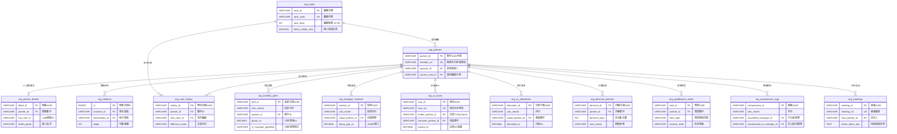

```mermaid
erDiagram
    org_ranks ||--o{ org_partners : "當前職級"
    org_ranks ||--o{ org_rank_history : "晉升目標"
    org_partners ||--o| org_partner_details : "1:1 垂直擴充"
    org_partners ||--o{ org_relations : "雙鏈閉包"
    org_partners ||--o{ org_rank_history : "晉升歷程"
    org_partners ||--o{ org_monthly_perfs : "月度業績"
    org_partners ||--o{ org_manager_monitors : "門檻調度"
    org_partners ||--o{ org_sv_loans : "出借/借入"
    org_partners ||--o{ org_sv_allocations : "積分落點"
    org_partners ||--o{ org_dormant_partners : "沉睡追蹤"
    org_partners ||--o{ org_qualification_alerts : "資格預警"
    org_partners ||--o{ org_compression_logs : "緊縮歸併"
    org_partners ||--o{ org_meetings : "主持/與會"

    org_partners {
        VARCHAR partner_id PK "夥伴UUID代碼"
        VARCHAR member_no UK "葡眾官方經銷商號"
        VARCHAR sponsor_id FK "直屬推薦人"
        VARCHAR current_rank_id FK "當前職級代碼"
    }

    org_partner_details {
        VARCHAR detail_id PK "明細UUID"
        VARCHAR partner_id FK "關聯夥伴"
        VARCHAR line_user_id "LINE推播ID"
        VARCHAR health_goals "個人訴求"
    }

    org_relations {
        BIGINT id PK "關聯自增ID"
        VARCHAR ancestor_id FK "祖先節點"
        VARCHAR descendant_id FK "後代節點"
        INT depth "代數距離"
    }

    org_ranks {
        VARCHAR rank_id PK "職級主鍵"
        VARCHAR rank_code UK "職級代碼"
        INT rank_level "職級階層 10~90"
        DECIMAL direct_rebate_rate "個人回饋比率"
    }

    org_rank_history {
        VARCHAR history_id PK "歷史記錄UUID"
        VARCHAR partner_id FK "夥伴ID"
        VARCHAR new_rank_id FK "晉升職級"
        VARCHAR effective_month "生效月份"
    }

    org_monthly_perfs {
        VARCHAR perf_id PK "業績記錄UUID"
        VARCHAR calc_month "結算月份"
        VARCHAR partner_id FK "夥伴ID"
        DECIMAL group_sv "小組整組SV"
        VARCHAR is_manager_qualified "合格經理標記"
    }

    org_manager_monitors {
        VARCHAR monitor_id PK "監控UUID"
        VARCHAR calc_month "監控月份"
        VARCHAR target_partner_id FK "目標經理"
        DECIMAL group_gap_sv "12000缺口"
    }

    org_sv_loans {
        VARCHAR loan_id PK "借貸UUID"
        VARCHAR loan_no UK "借貸流水單號"
        VARCHAR lender_partner_id FK "出借人Ray/Jarvis"
        VARCHAR borrower_partner_id FK "借點夥伴"
        DECIMAL loaned_sv "出借SV點數"
    }

    org_sv_allocations {
        VARCHAR allocation_id PK "分配方案UUID"
        VARCHAR calc_month "月份"
        VARCHAR target_partner_id FK "落點夥伴"
        DECIMAL allocated_sv "分配SV"
    }

    org_dormant_partners {
        VARCHAR dormant_id PK "沉睡記錄UUID"
        VARCHAR partner_id FK "沉睡夥伴"
        INT dormant_days "未活動天數"
        VARCHAR care_status "關懷狀態"
    }

    org_qualification_alerts {
        VARCHAR alert_id PK "預警UUID"
        VARCHAR partner_id FK "預警夥伴"
        VARCHAR alert_type "預警類型四重"
        VARCHAR severity_level "危急等級"
    }

    org_compression_logs {
        VARCHAR compression_id PK "緊縮UUID"
        VARCHAR calc_month "月份"
        VARCHAR uncertified_manager_id FK "不合格經理"
        VARCHAR compressed_to_manager_id FK "向上歸併經理"
    }

    org_meetings {
        VARCHAR meeting_id PK "會議UUID"
        VARCHAR meeting_no UK "會議編號"
        VARCHAR host_partner_id FK "主持人"
        TEXT action_items_json "待辦事項清單"
    }
```
