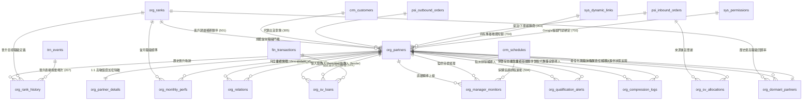

```mermaid
erDiagram
    %% 外部模組關聯實體
    sys_permissions ||--o| org_partners : "Google帳號門禁綁定 (702)"
    sys_dynamic_links ||--o{ org_partners : "持有專屬推廣短鏈 (704)"
    psi_inbound_orders ||--o{ org_partners : "提貨/下單經銷商 (303)"
    psi_outbound_orders ||--o{ org_partners : "代領出貨對象 (305)"
    crm_customers ||--o{ org_partners : "客戶歸屬輔導夥伴 (501)"
    crm_schedules ||--o{ org_manager_monitors : "採購協調排程連動 (504)"
    fin_transactions ||--o{ org_sv_loans : "借貸還款流水銷帳 (601)"
    trn_events ||--o{ org_rank_history : "晉升表揚授勳場次 (207)"

    %% 夥伴模組核心內部關聯
    org_partners ||--|| org_partner_details : "1:1 高敏個資加密隔離"
    org_ranks ||--o{ org_partners : "規範當前職級門檻"
    org_ranks ||--o{ org_rank_history : "晉升目標職級定義"
    org_partners ||--o{ org_rank_history : "歷史晉升軌跡"
    
    org_partners ||--o{ org_relations : "祖先節點 (ancestor_id)"
    org_partners ||--o{ org_relations : "後代節點 (descendant_id)"
    
    org_partners ||--o{ org_monthly_perfs : "月度業績快照"
    org_ranks ||--o{ org_monthly_perfs : "當月職級標準"
    
    org_partners ||--o{ org_sv_loans : "借出點數人 (lender)"
    org_partners ||--o{ org_sv_loans : "借入點數人 (borrower)"
    
    org_partners ||--o{ org_manager_monitors : "監控目標經理"
    org_partners ||--o{ org_manager_monitors : "直屬輔導上線"
    
    org_partners ||--o{ org_qualification_alerts : "預警受影響對象"
    org_partners ||--o{ org_qualification_alerts : "指派排除輔導人"
    
    org_partners ||--o{ org_sv_allocations : "最佳化建議受益人"
    psi_inbound_orders ||--o{ org_sv_allocations : "來源進貨單據"
    
    org_partners ||--o{ org_compression_logs : "領取代數獎金領導人"
    org_partners ||--o{ org_compression_logs : "產生業績基層夥伴"
    
    org_partners ||--|| org_dormant_partners : "沉睡夥伴狀態追蹤"
    org_partners ||--o{ org_dormant_partners : "指派喚醒責任輔導人"
    org_ranks ||--o{ org_dormant_partners : "歷史最高職級回饋率"
```
