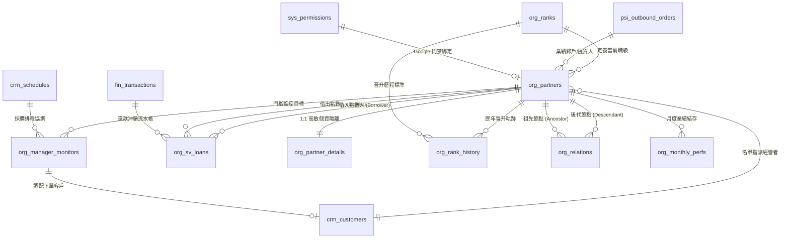

```mermaid
erDiagram
    %% 外部依賴核心模組
    sys_permissions ||--o| org_partners : "Google 門禁綁定"
    psi_outbound_orders ||--o{ org_partners : "業績歸戶/提貨人"
    crm_customers ||--o{ org_partners : "名單指派經營者"
    crm_schedules ||--o{ org_manager_monitors : "採購排程協調"
    fin_transactions ||--o{ org_sv_loans : "還款沖銷流水帳"

    %% 組織內部實體關聯
    org_partners ||--|| org_partner_details : "1:1 高敏個資隔離"
    org_ranks ||--o{ org_partners : "定義當前職級"
    org_ranks ||--o{ org_rank_history : "晉升歷程標準"
    
    org_partners ||--o{ org_rank_history : "歷年晉升軌跡"
    org_partners ||--o{ org_relations : "祖先節點 (Ancestor)"
    org_partners ||--o{ org_relations : "後代節點 (Descendant)"
    org_partners ||--o{ org_monthly_perfs : "月度業績結存"
    
    org_partners ||--o{ org_sv_loans : "借出點數人 (Lender)"
    org_partners ||--o{ org_sv_loans : "借入點數人 (Borrower)"
    org_partners ||--o{ org_manager_monitors : "門檻監控目標"
    
    org_manager_monitors ||--o| crm_customers : "調配下單客戶"
```
