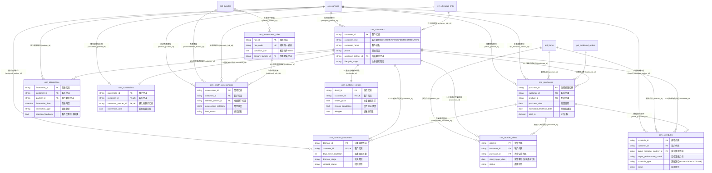

```mermaid
erDiagram
    %% 外部關聯實體
    org_partners ||--o{ crm_customers : "指派負責夥伴 (assigned_partner_id)"
    org_partners ||--o{ crm_purchases : "開單銷售夥伴 (sales_partner_id)"
    org_partners ||--o{ crm_purchases : "掛點受惠夥伴 (sv_recipient_partner_id)"
    org_partners ||--o{ crm_schedules : "目標衝刺經理 (target_manager_partner_id)"
    org_partners ||--o{ crm_interactions : "執行關懷夥伴 (partner_id)"
    org_partners ||--o| crm_conversions : "轉化後夥伴主檔 (converted_partner_id)"
    org_partners ||--o{ crm_health_assessments : "來源推薦夥伴 (referrer_partner_id)"
    org_partners ||--o{ crm_dormant_customers : "指派挽回夥伴 (assigned_partner_id)"
    
    prd_items ||--o{ crm_purchases : "購買品項 (product_id)"
    prd_items ||--o{ crm_schedules : "預計品項 (product_id)"
    prd_items ||--o{ crm_reorder_alerts : "預警品項 (product_id)"
    prd_bundles ||--o{ crm_health_assessments : "推薦套裝 (recommended_bundle_id)"
    prd_bundles ||--o{ crm_assessment_rules : "主要命中套裝 (primary_bundle_id)"
    psi_outbound_orders ||--o{ crm_purchases : "出庫銷貨單 (outbound_id)"
    sys_dynamic_links ||--o{ crm_customers : "引流短網址 (dynamic_link_id)"
    sys_dynamic_links ||--o{ crm_health_assessments : "來源短網址 (dynamic_link_id)"

    %% CRM 核心 10 大資料表關聯
    crm_customers ||--|| crm_customer_details : "1:1 垂直分割健康隱私 (customer_id)"
    crm_customers ||--o{ crm_purchases : "1:N 零售消費紀錄 (customer_id)"
    crm_customers ||--o{ crm_schedules : "1:N 採購調配排程 (customer_id)"
    crm_customers ||--o{ crm_interactions : "1:N 關懷溝通軌跡 (customer_id)"
    crm_customers ||--o| crm_conversions : "1:1 簽約轉經銷商 (customer_id)"
    crm_customers ||--o{ crm_reorder_alerts : "1:N 耗盡前復購通知 (customer_id)"
    crm_customers ||--o{ crm_health_assessments : "1:N 體質測評歷史 (customer_id)"
    crm_customers ||--o| crm_dormant_customers : "1:1 沉睡客戶追蹤 (customer_id)"

    crm_purchases ||--o{ crm_reorder_alerts : "觸發 7 天前預警 (purchase_id)"
    crm_purchases ||--o{ crm_schedules : "排程履約綁定 (actual_purchase_id)"
    crm_purchases ||--o{ crm_dormant_customers : "復購激活銷帳 (reactivated_purchase_id)"
    crm_assessment_rules ||--o{ crm_health_assessments : "命中規則判讀 (matched_rule_id)"

    %% 實體屬性定義
    crm_customers {
        string customer_id PK "客戶代碼"
        string customer_type "客戶類型(CONSUMER/PROSPECT/DISTRIBUTOR)"
        string customer_name "客戶姓名"
        string phone "聯絡電話"
        string assigned_partner_id FK "負責夥伴代碼"
        string lifecycle_stage "生命週期階段"
    }

    crm_customer_details {
        string detail_id PK "詳情代碼"
        string customer_id FK,UK "客戶代碼"
        text health_goals "主要養生訴求"
        text chronic_conditions "慢性病史/體質"
        text allergies "過敏原清單"
    }

    crm_purchases {
        string purchase_id PK "消費紀錄代碼"
        string customer_id FK "客戶代碼"
        string product_id FK "產品代碼"
        date purchase_date "購買日期"
        date estimated_depletion_date "預估耗盡日"
        decimal total_sv "SV點數"
    }

    crm_schedules {
        string schedule_id PK "排程代碼"
        string customer_id FK "客戶代碼"
        string target_manager_partner_id FK "衝刺經理代碼"
        string target_performance_month "目標業績月份"
        string schedule_type "調配類型(ADVANCE/POSTPONE)"
        string status "排程狀態"
    }

    crm_interactions {
        string interaction_id PK "互動代碼"
        string customer_id FK "客戶代碼"
        string partner_id FK "執行夥伴代碼"
        datetime interaction_date "互動時間"
        string interaction_type "關懷類型"
        text reaction_feedback "客戶反應/好轉反應"
    }

    crm_conversions {
        string conversion_id PK "轉化代碼"
        string customer_id FK,UK "客戶代碼"
        string converted_partner_id FK,UK "轉化後夥伴代碼"
        date conversion_date "簽約加盟日期"
    }

    crm_reorder_alerts {
        string alert_id PK "預警代碼"
        string customer_id FK "客戶代碼"
        string purchase_id FK "消費紀錄代碼"
        date alert_trigger_date "預警觸發日(耗盡前7天)"
        string status "處理狀態"
    }

    crm_health_assessments {
        string assessment_id PK "問卷代碼"
        string customer_id FK "客戶代碼"
        string referrer_partner_id FK "推薦夥伴代碼"
        string assessment_category "問卷維度"
        string lead_status "線索狀態"
    }

    crm_assessment_rules {
        string rule_id PK "規則代碼"
        string rule_code UK "規則唯一編碼"
        text condition_json "觸發條件JSON"
        string primary_bundle_id FK "推薦套裝代碼"
    }

    crm_dormant_customers {
        string dormant_id PK "沉睡追蹤代碼"
        string customer_id FK,UK "客戶代碼"
        int days_since_depletion "耗盡逾期天數"
        string dormant_stage "流失階段"
        string winback_status "挽回狀態"
    }
```
