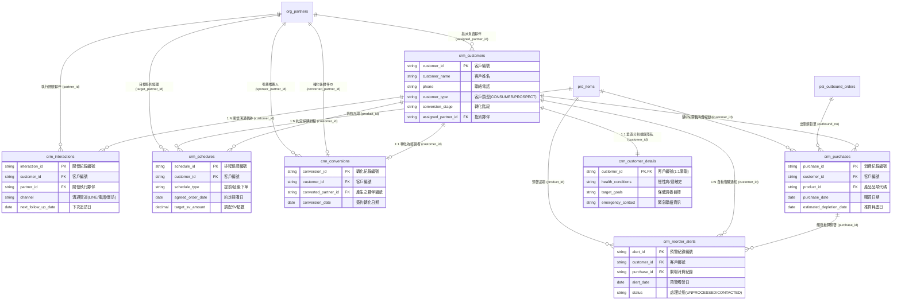

```mermaid
erDiagram
    %% 外部關聯實體
    org_partners ||--o{ crm_customers : "指派負責夥伴 (assigned_partner_id)"
    org_partners ||--o{ crm_interactions : "執行關懷夥伴 (partner_id)"
    org_partners ||--o{ crm_schedules : "目標衝刺經理 (target_partner_id)"
    org_partners ||--o{ crm_conversions : "引薦推薦人 (sponsor_partner_id)"
    org_partners ||--o| crm_conversions : "轉化後夥伴ID (converted_partner_id)"
    prd_items ||--o{ crm_purchases : "購買品項 (product_id)"
    prd_items ||--o{ crm_schedules : "排程品項 (product_id)"
    prd_items ||--o{ crm_reorder_alerts : "預警品項 (product_id)"
    psi_outbound_orders ||--o{ crm_purchases : "出庫銷貨單 (outbound_no)"

    %% CRM 核心 7 大表
    crm_customers ||--|| crm_customer_details : "1:1 垂直分割健康隱私 (customer_id)"
    crm_customers ||--o{ crm_purchases : "1:N 零售消費紀錄 (customer_id)"
    crm_customers ||--o{ crm_schedules : "1:N 約定採購排程 (customer_id)"
    crm_customers ||--o{ crm_interactions : "1:N 關懷溝通軌跡 (customer_id)"
    crm_customers ||--o| crm_conversions : "1:1 轉化為經營者 (customer_id)"
    crm_customers ||--o{ crm_reorder_alerts : "1:N 自動復購通知 (customer_id)"
    crm_purchases ||--o{ crm_reorder_alerts : "觸發推算預警 (purchase_id)"

    crm_customers {
        string customer_id PK "客戶編號"
        string customer_name "客戶姓名"
        string phone "聯絡電話"
        string customer_type "客戶類型(CONSUMER/PROSPECT)"
        string conversion_stage "轉化階段"
        string assigned_partner_id FK "指派夥伴"
    }

    crm_customer_details {
        string customer_id PK,FK "客戶編號(1:1關聯)"
        string health_conditions "慢性病/過敏史"
        string target_goals "保健調養目標"
        string emergency_contact "緊急聯絡資訊"
    }

    crm_purchases {
        string purchase_id PK "消費紀錄編號"
        string customer_id FK "客戶編號"
        string product_id FK "產品品項代碼"
        date purchase_date "購買日期"
        date estimated_depletion_date "推算耗盡日"
    }

    crm_schedules {
        string schedule_id PK "排程協調編號"
        string customer_id FK "客戶編號"
        string schedule_type "提前/延後下單"
        date agreed_order_date "約定採購日"
        decimal target_sv_amount "調配SV點數"
    }

    crm_interactions {
        string interaction_id PK "關懷紀錄編號"
        string customer_id FK "客戶編號"
        string partner_id FK "關懷執行夥伴"
        string channel "溝通管道(LINE/電話/面訪)"
        date next_follow_up_date "下次追訪日"
    }

    crm_conversions {
        string conversion_id PK "轉化紀錄編號"
        string customer_id FK "客戶編號"
        string converted_partner_id FK "產生之夥伴編號"
        date conversion_date "簽約轉化日期"
    }

    crm_reorder_alerts {
        string alert_id PK "預警紀錄編號"
        string customer_id FK "客戶編號"
        string purchase_id FK "關聯消費紀錄"
        date alert_date "預警觸發日"
        string status "處理狀態(UNPROCESSED/CONTACTED)"
    }
```
