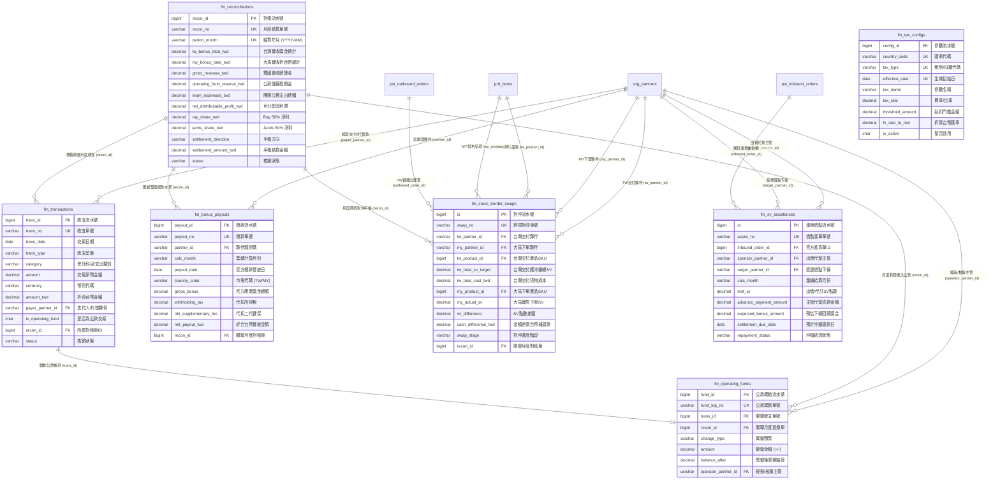

```mermaid
erDiagram
    %% ==========================================
    %% 外部模組關聯實體
    %% ==========================================
    org_partners ||--o{ fin_transactions : "經辦/支付/代墊款 (payer_partner_id)"
    org_partners ||--o{ fin_operating_funds : "經辦/核銷主管 (operator_partner_id)"
    org_partners ||--o{ fin_bonus_payouts : "直銷商夥伴 (partner_id)"
    org_partners ||--o{ fin_cross_border_swaps : "TW交付夥伴 (tw_partner_id)"
    org_partners ||--o{ fin_cross_border_swaps : "MY下單夥伴 (my_partner_id)"
    org_partners ||--o{ fin_sv_assistances : "出資代墊主管 (sponsor_partner_id)"
    org_partners ||--o{ fin_sv_assistances : "受惠借點下線 (target_partner_id)"
    
    prd_items ||--o{ fin_cross_border_swaps : "TW交付品項 (tw_product_id)"
    prd_items ||--o{ fin_cross_border_swaps : "MY對沖品項 (my_product_id)"
    
    psi_inbound_orders ||--o{ fin_sv_assistances : "觸發湊單進貨單 (inbound_order_id)"
    psi_outbound_orders ||--o{ fin_cross_border_swaps : "TW實體出庫單 (outbound_order_id)"

    %% ==========================================
    %% 財務模組內部關聯實體
    %% ==========================================
    fin_reconciliations ||--o{ fin_transactions : "核銷歸屬月度收支 (recon_id)"
    fin_reconciliations ||--o{ fin_operating_funds : "月度利潤撥入公款 (recon_id)"
    fin_reconciliations ||--o{ fin_bonus_payouts : "匯總雙國撥款水單 (recon_id)"
    fin_reconciliations ||--o{ fin_cross_border_swaps : "月度跨境對沖平帳 (recon_id)"
    fin_transactions ||--o| fin_operating_funds : "聯動公款帳目 (trans_id)"

    %% ==========================================
    %% 財務模組 7 大資料表實體欄位定義
    %% ==========================================
    fin_reconciliations {
        bigint recon_id PK "對帳流水號"
        varchar recon_no UK "月度結算單號"
        varchar period_month UK "結算年月 (YYYY-MM)"
        decimal tw_bonus_total_twd "台灣實收獎金總計"
        decimal my_bonus_total_twd "大馬實收折台幣總計"
        decimal gross_revenue_twd "雙國實收總營收"
        decimal operating_fund_reserve_twd "公款儲備提撥金"
        decimal team_expenses_twd "團隊公費支出總額"
        decimal net_distributable_profit_twd "可分配淨利潤"
        decimal ray_share_twd "Ray 50% 淨利"
        decimal jarvis_share_twd "Jarvis 50% 淨利"
        varchar settlement_direction "平帳方向"
        decimal settlement_amount_twd "平帳結算金額"
        varchar status "核銷狀態"
    }

    fin_transactions {
        bigint trans_id PK "收支流水號"
        varchar trans_no UK "收支單號"
        date trans_date "交易日期"
        varchar trans_type "收支型態"
        varchar category "會計科目/支出類別"
        decimal amount "交易原幣金額"
        varchar currency "幣別代碼"
        decimal amount_twd "折合台幣金額"
        varchar payer_partner_id FK "支付人/代墊夥伴"
        char is_operating_fund "是否為公款交易"
        bigint recon_id FK "所屬對帳單ID"
        varchar status "核銷狀態"
    }

    fin_operating_funds {
        bigint fund_id PK "公款異動流水號"
        varchar fund_log_no UK "公款異動單號"
        bigint trans_id FK "關聯收支單號"
        bigint recon_id FK "關聯月度提撥單"
        varchar change_type "異動類型"
        decimal amount "變動金額 (+/-)"
        decimal balance_after "異動後累積結餘"
        varchar operator_partner_id FK "經辦/核銷主管"
    }

    fin_bonus_payouts {
        bigint payout_id PK "撥款流水號"
        varchar payout_no UK "撥款單號"
        varchar partner_id FK "夥伴識別碼"
        varchar calc_month "業績計算月份"
        date payout_date "官方撥款發放日"
        varchar country_code "市場代碼 (TW/MY)"
        decimal gross_bonus "官方應發獎金總額"
        decimal withholding_tax "代扣所得稅"
        decimal nhi_supplementary_fee "代扣二代健保"
        decimal net_payout_twd "折合台幣實收金額"
        bigint recon_id FK "關聯月度對帳單"
    }

    fin_tax_configs {
        bigint config_id PK "參數流水號"
        varchar country_code UK "國家代碼"
        varchar tax_type UK "稅制/扣繳代碼"
        date effective_date UK "生效起始日"
        varchar tax_name "參數名稱"
        decimal tax_rate "費率/比率"
        decimal threshold_amount "起扣門檻金額"
        decimal fx_rate_to_twd "折算台幣匯率"
        char is_active "是否啟用"
    }

    fin_cross_border_swaps {
        bigint id PK "對沖流水號"
        varchar swap_no UK "跨境對沖單號"
        varchar tw_partner_id FK "台灣交付夥伴"
        varchar my_partner_id FK "大馬下單夥伴"
        bigint tw_product_id FK "台灣交付產品SKU"
        decimal tw_total_sv_target "台灣交付應沖銷總SV"
        decimal tw_total_cost_twd "台灣交付貨物成本"
        bigint my_product_id FK "大馬下單產品SKU"
        decimal my_actual_sv "大馬實際下單SV"
        decimal sv_difference "SV點數差額"
        decimal cash_difference_twd "金額差價台幣補退款"
        varchar swap_stage "對沖進度階段"
        bigint recon_id FK "關聯月度對帳單"
    }

    fin_sv_assistances {
        bigint id PK "湊單借點流水號"
        varchar assist_no UK "借點湊單單號"
        bigint inbound_order_id FK "官方進貨單ID"
        varchar sponsor_partner_id FK "出資代墊主管"
        varchar target_partner_id FK "受惠借點下線"
        varchar calc_month "業績結算月份"
        decimal lent_sv "出借/代訂SV點數"
        decimal advance_payment_amount "主管代墊貨款金額"
        decimal expected_bonus_amount "預估下線回饋獎金"
        date settlement_due_date "預計沖銷還款日"
        varchar repayment_status "沖銷結清狀態"
    }
```
