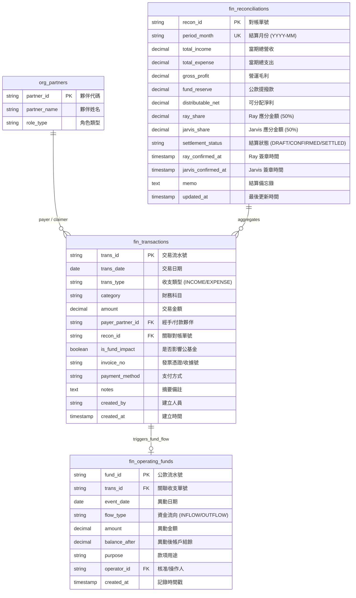

```mermaid
erDiagram
    org_partners ||--o{ fin_transactions : "payer / claimer"
    fin_reconciliations ||--o{ fin_transactions : "aggregates"
    fin_transactions ||--o| fin_operating_funds : "triggers_fund_flow"

    org_partners {
        string partner_id PK "夥伴代碼"
        string partner_name "夥伴姓名"
        string role_type "角色類型"
    }

    fin_transactions {
        string trans_id PK "交易流水號"
        date trans_date "交易日期"
        string trans_type "收支類型 (INCOME/EXPENSE)"
        string category "財務科目"
        decimal amount "交易金額"
        string payer_partner_id FK "經手/付款夥伴"
        string recon_id FK "關聯對帳單號"
        boolean is_fund_impact "是否影響公基金"
        string invoice_no "發票憑證/收據號"
        string payment_method "支付方式"
        text notes "摘要備註"
        string created_by "建立人員"
        timestamp created_at "建立時間"
    }

    fin_reconciliations {
        string recon_id PK "對帳單號"
        string period_month UK "結算月份 (YYYY-MM)"
        decimal total_income "當期總營收"
        decimal total_expense "當期總支出"
        decimal gross_profit "營運毛利"
        decimal fund_reserve "公款提撥款"
        decimal distributable_net "可分配淨利"
        decimal ray_share "Ray 應分金額 (50%)"
        decimal jarvis_share "Jarvis 應分金額 (50%)"
        string settlement_status "結算狀態 (DRAFT/CONFIRMED/SETTLED)"
        timestamp ray_confirmed_at "Ray 簽章時間"
        timestamp jarvis_confirmed_at "Jarvis 簽章時間"
        text memo "結算備忘錄"
        timestamp updated_at "最後更新時間"
    }

    fin_operating_funds {
        string fund_id PK "公款流水號"
        string trans_id FK "關聯收支單號"
        date event_date "異動日期"
        string flow_type "資金流向 (INFLOW/OUTFLOW)"
        decimal amount "異動金額"
        decimal balance_after "異動後帳戶結餘"
        string purpose "款項用途"
        string operator_id FK "核准/操作人"
        timestamp created_at "記錄時間戳"
    }
```
