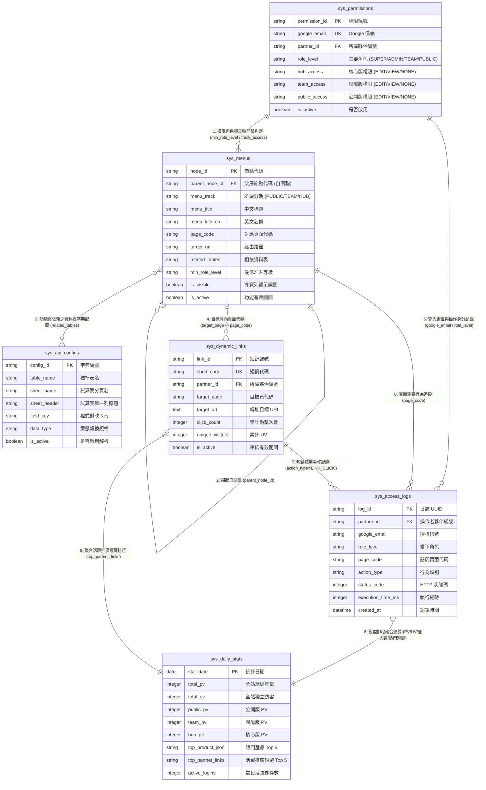

```mermaid
erDiagram
    %% ==========================================
    %% 系統模組內部實體關聯圖 (Internal Module ERD)
    %% ==========================================

    sys_permissions ||--o{ sys_menus : "1. 權限角色與三軌門禁判定 (min_role_level / track_access)"
    sys_menus ||--o{ sys_menus : "2. 樹狀自關聯 (parent_node_id)"
    sys_menus }o--o{ sys_api_configs : "3. 功能頁依賴之資料表字典配置 (related_tables)"
    sys_menus ||--o{ sys_dynamic_links : "4. 目標導向頁面代碼 (target_page -> page_code)"
    
    sys_permissions ||--o{ sys_access_logs : "5. 登入鑑權與操作身分記錄 (google_email / role_level)"
    sys_menus ||--o{ sys_access_logs : "6. 頁面瀏覽行為追蹤 (page_code)"
    sys_dynamic_links ||--o{ sys_access_logs : "7. 短鏈點擊事件記錄 (action_type='LINK_CLICK')"
    
    sys_access_logs }|--|| sys_daily_stats : "8. 夜間排程聚合運算 (PV/UV/登入數/熱門短鏈)"
    sys_dynamic_links }|--|| sys_daily_stats : "9. 聚合活躍推廣短鏈排行 (top_partner_links)"

    %% ------------------------------------------
    %% 資料表實體欄位定義
    %% ------------------------------------------

    sys_permissions {
        string permission_id PK "權限編號"
        string google_email UK "Google 信箱"
        string partner_id FK "所屬夥伴編號"
        string role_level "主要角色 (SUPER/ADMIN/TEAM/PUBLIC)"
        string hub_access "核心版權限 (EDIT/VIEW/NONE)"
        string team_access "團隊版權限 (EDIT/VIEW/NONE)"
        string public_access "公開版權限 (EDIT/VIEW/NONE)"
        boolean is_active "是否啟用"
    }

    sys_menus {
        string node_id PK "節點代碼"
        string parent_node_id FK "父層節點代碼 (自關聯)"
        string menu_track "所屬分軌 (PUBLIC/TEAM/HUB)"
        string menu_title "中文標題"
        string menu_title_en "英文名稱"
        string page_code "對應頁面代碼"
        string target_url "路由路徑"
        string related_tables "相依資料表"
        string min_role_level "最低准入等級"
        boolean is_visible "導覽列顯示開關"
        boolean is_active "功能有效開關"
    }

    sys_api_configs {
        string config_id PK "字典編號"
        string table_name "標準表名"
        string sheet_name "試算表分頁名"
        string sheet_header "試算表第一列標題"
        string field_key "程式對映 Key"
        string data_type "型態轉換規格"
        boolean is_active "是否啟用解析"
    }

    sys_dynamic_links {
        string link_id PK "短鏈編號"
        string short_code UK "短網代碼"
        string partner_id FK "所屬夥伴編號"
        string target_page "目標頁代碼"
        text target_url "轉址目標 URL"
        integer click_count "累計點擊次數"
        integer unique_visitors "累計 UV"
        boolean is_active "連結有效開關"
    }

    sys_access_logs {
        string log_id PK "日誌 UUID"
        string partner_id FK "操作者夥伴編號"
        string google_email "授權帳號"
        string role_level "當下角色"
        string page_code "訪問頁面代碼"
        string action_type "行為類別"
        integer status_code "HTTP 狀態碼"
        integer execution_time_ms "執行耗時"
        datetime created_at "紀錄時間"
    }

    sys_daily_stats {
        date stat_date PK "統計日期"
        integer total_pv "全站總瀏覽量"
        integer total_uv "全站獨立訪客"
        integer public_pv "公開版 PV"
        integer team_pv "團隊版 PV"
        integer hub_pv "核心版 PV"
        string top_product_json "熱門產品 Top 5"
        string top_partner_links "活躍推廣短鏈 Top 5"
        integer active_logins "當日活躍夥伴數"
    }
```