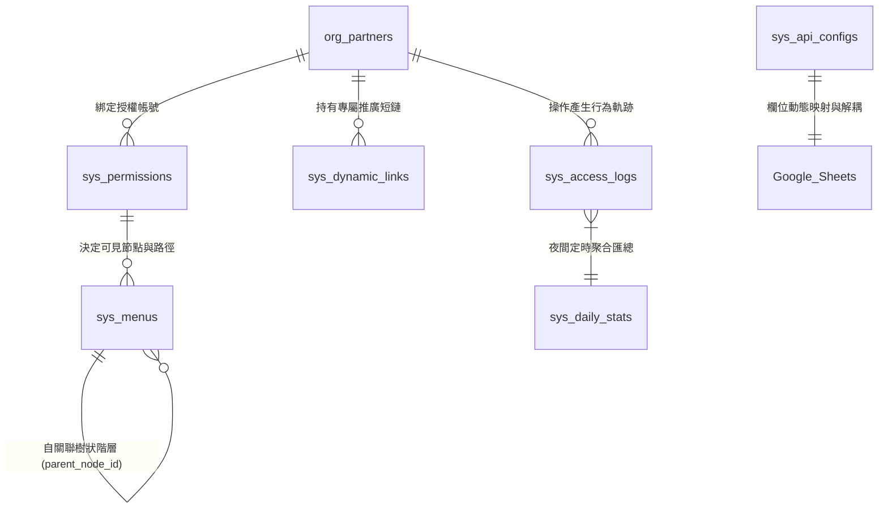

```mermaid
erDiagram
    org_partners ||--o{ sys_permissions : "綁定授權帳號"
    org_partners ||--o{ sys_dynamic_links : "持有專屬推廣短鏈"
    org_partners ||--o{ sys_access_logs : "操作產生行為軌跡"
    
    sys_permissions ||--o{ sys_menus : "決定可見節點與路徑"
    sys_menus ||--o{ sys_menus : "自關聯樹狀階層 (parent_node_id)"
    
    sys_api_configs ||--|| Google_Sheets : "欄位動態映射與解耦"
    
    sys_access_logs }|--|| sys_daily_stats : "夜間定時聚合匯總"
```
