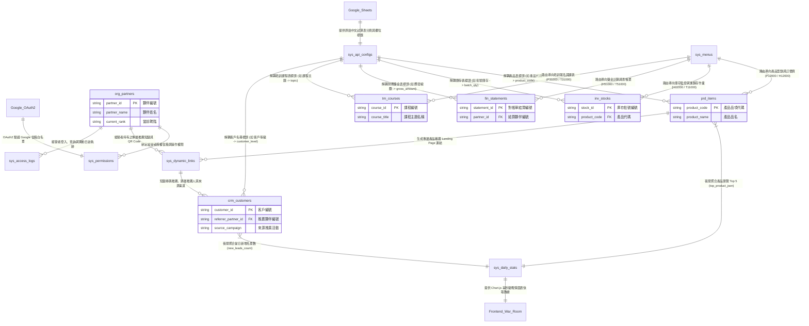

```mermaid
erDiagram
    %% ==========================================
    %% 外部與跨模組實體關聯圖 (Cross-Module ERD)
    %% ==========================================

    %% --- 1. 外部雲端與前端視圖層 ---
    Google_OAuth2 ||--|| sys_permissions : "OAuth2 驗證 Google 信箱白名單"
    Google_Sheets ||--|| sys_api_configs : "提供原始中文試算表分頁與欄位標題"
    sys_daily_stats ||--|| Frontend_War_Room : "提供 Chart.js 毫秒級戰情圖表快取數據"

    %% --- 2. 組織模組 (org_) 關聯 ---
    org_partners ||--o{ sys_permissions : "綁定經營者授權信箱與操作權限"
    org_partners ||--o{ sys_dynamic_links : "經營者持有之專屬推薦短鏈與 QR Code"
    org_partners ||--o{ sys_access_logs : "經營者登入、查詢與異動日誌軌跡"

    %% --- 3. 客戶模組 (crm_) 關聯 ---
    sys_dynamic_links ||--o{ crm_customers : "短鏈掃碼推薦，歸屬推薦人與來源渠道"
    crm_customers }|--|| sys_daily_stats : "夜間聚合當日新增名單數 (new_leads_count)"

    %% --- 4. 產品模組 (prd_) 關聯 ---
    prd_items }|--|| sys_daily_stats : "夜間聚合產品瀏覽 Top 5 (top_product_json)"
    prd_items ||--o{ sys_dynamic_links : "生成專屬產品推廣 Landing Page 連結"

    %% --- 5. 業務模組與轉接字典層 (反腐化中介) ---
    sys_api_configs ||--o{ prd_items : "解耦產品表標頭 (如 產品代碼 -> product_code)"
    sys_api_configs ||--o{ inv_stocks : "解耦庫存表標頭 (如 批號庫存 -> batch_qty)"
    sys_api_configs ||--o{ fin_statements : "解耦財務獎金表標頭 (如 應發總額 -> gross_amount)"
    sys_api_configs ||--o{ trn_courses : "解耦培訓課程表標頭 (如 課程主題 -> topic)"
    sys_api_configs ||--o{ crm_customers : "解耦客戶名冊標頭 (如 客戶等級 -> customer_level)"

    %% --- 6. 選單架構與全站功能路由相依 ---
    sys_menus ||--o{ prd_items : "路由導向產品型錄與訂價頁 (P12000 / H12000)"
    sys_menus ||--o{ inv_stocks : "路由導向庫存監控與進銷存作業 (H11000 / T11000)"
    sys_menus ||--o{ fin_statements : "路由導向獎金計算與對帳單 (H51000 / T51000)"
    sys_menus ||--o{ trn_courses : "路由導向培訓報名與課表 (P31000 / T31000)"

    %% ------------------------------------------
    %% 外部模組實體簡化定義
    %% ------------------------------------------

    org_partners {
        string partner_id PK "夥伴編號"
        string partner_name "夥伴姓名"
        string current_rank "當前聘階"
    }

    crm_customers {
        string customer_id PK "客戶編號"
        string referrer_partner_id FK "推薦夥伴編號"
        string source_campaign "來源推廣活動"
    }

    prd_items {
        string product_code PK "產品品項代碼"
        string product_name "產品品名"
    }

    inv_stocks {
        string stock_id PK "庫存批號編號"
        string product_code FK "產品代碼"
    }

    fin_statements {
        string statement_id PK "對帳單結算編號"
        string partner_id FK "結算夥伴編號"
    }

    trn_courses {
        string course_id PK "課程編號"
        string course_title "課程主題名稱"
    }
```