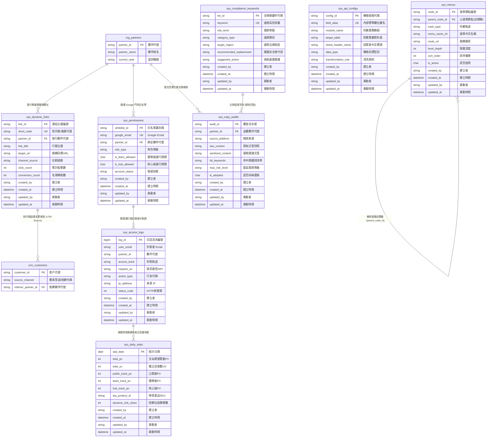

```mermaid
erDiagram
    %% 外部模組關聯實體
    org_partners {
        string partner_id PK "夥伴代號"
        string partner_name "夥伴姓名"
        string current_rank "當前職級"
    }

    crm_customers {
        string customer_id PK "客戶代號"
        string source_channel "獲客管道/短網代碼"
        string referrer_partner_id FK "推薦夥伴代號"
    }

    %% 系統模組 8 個核心資料表
    sys_permissions {
        string whitelist_id PK "白名單識別碼"
        string google_email UK "Google Email"
        string partner_id FK "綁定夥伴代號"
        string role_type "角色等級"
        char is_team_allowed "團隊版通行開關"
        char is_hub_allowed "核心版通行開關"
        string account_status "帳號狀態"
        string created_by "建立者"
        datetime created_at "建立時間"
        string updated_by "異動者"
        datetime updated_at "異動時間"
    }

    sys_access_logs {
        bigint log_id PK "日誌流水編號"
        string user_email "存取者 Email"
        string partner_id "夥伴代號"
        string access_track "存取軌道"
        string request_uri "請求路徑/API"
        string action_type "行為代碼"
        string ip_address "來源 IP"
        int status_code "HTTP狀態碼"
        string created_by "建立者"
        datetime created_at "建立時間"
        string updated_by "異動者"
        datetime updated_at "異動時間"
    }

    sys_menus {
        string node_id PK "選單節點編號"
        string parent_node_id FK "父選單節點(自關聯)"
        string track_type "所屬軌道"
        string menu_name_zh "選單中文名稱"
        string route_url "跳轉路徑"
        int level_depth "階層深度"
        int sort_order "排序權重"
        char is_active "是否啟用"
        string created_by "建立者"
        datetime created_at "建立時間"
        string updated_by "異動者"
        datetime updated_at "異動時間"
    }

    sys_dynamic_links {
        string link_id PK "連結主檔編號"
        string short_code UK "短代碼/推廣代號"
        string partner_id FK "發行夥伴代號"
        string link_title "行銷主題"
        string target_url "跳轉目標URL"
        string channel_source "社群通路"
        int click_count "累計點擊數"
        int conversion_count "名單轉換數"
        string created_by "建立者"
        datetime created_at "建立時間"
        string updated_by "異動者"
        datetime updated_at "異動時間"
    }

    sys_api_configs {
        string config_id PK "轉接組態代碼"
        string field_alias UK "內部標準欄位鍵名"
        string module_name "所屬業務模組"
        string target_table "對應實體資料表"
        string sheet_header_name "試算表中文標頭"
        string data_type "轉換目標型別"
        string transformation_rule "清洗規則"
        string created_by "建立者"
        datetime created_at "建立時間"
        string updated_by "異動者"
        datetime updated_at "異動時間"
    }

    sys_daily_stats {
        date stat_date PK "統計日期"
        int total_pv "全站總瀏覽量PV"
        int total_uv "獨立訪客數UV"
        int public_track_pv "公開版PV"
        int team_track_pv "團隊版PV"
        int hub_track_pv "核心版PV"
        string top_product_id "榜首產品SKU"
        int dynamic_link_clicks "短網址點擊總數"
        string created_by "建立者"
        datetime created_at "建立時間"
        string updated_by "異動者"
        datetime updated_at "異動時間"
    }

    sys_compliance_keywords {
        string kw_id PK "合規關鍵字代碼"
        string keyword UK "違規高危詞彙"
        string risk_level "風險等級"
        string category_type "違規類別"
        string target_region "適用法規地區"
        string recommended_replacement "建議安全替代詞"
        string suggested_action "系統處置建議"
        string created_by "建立者"
        datetime created_at "建立時間"
        string updated_by "異動者"
        datetime updated_at "異動時間"
    }

    sys_copy_audits {
        string audit_id PK "審查流水號"
        string partner_id FK "送審夥伴代號"
        string source_platform "檢測來源"
        string raw_content "原始文案快照"
        string sanitized_content "置換建議文案"
        string hit_keywords "命中關鍵詞清單"
        string max_risk_level "最高風險等級"
        char is_adopted "是否採納置換"
        string created_by "建立者"
        datetime created_at "建立時間"
        string updated_by "異動者"
        datetime updated_at "異動時間"
    }

    %% 關聯線定義
    org_partners ||--o{ sys_permissions : "開通 Google 門禁白名單"
    org_partners ||--o{ sys_dynamic_links : "發行專屬推廣短網址"
    org_partners ||--o{ sys_copy_audits : "提交宣傳文案合規檢測"

    sys_menus ||--o{ sys_menus : "樹狀階層自關聯 (parent_node_id)"

    sys_dynamic_links ||--o{ crm_customers : "短代碼追蹤名單來源 (UTM Source)"
    sys_compliance_keywords ||--o{ sys_copy_audits : "比對違規字詞 (規則匹配)"

    sys_permissions ||--o{ sys_access_logs : "驗證通行與記錄身分軌跡"
    sys_access_logs ||--o{ sys_daily_stats : "夜間排程匯總為每日流量快取"
```
